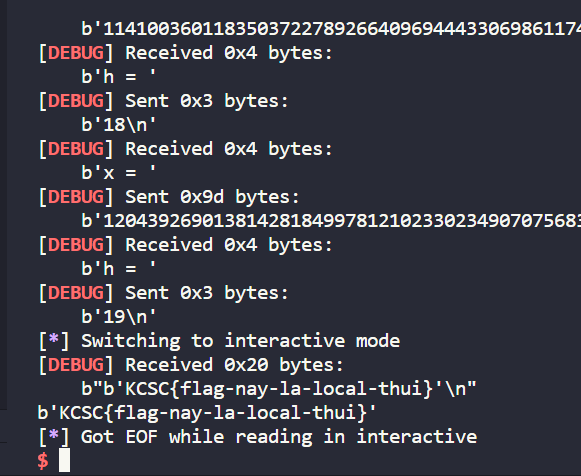

# Basic Math

Source code của chall như sau

```
from Crypto.Util.number import getPrime

flag = b'KCSC{fake_flag}'

def verify(g, p, y, x, k, h):
    return (y*x*pow(g, k, p)) % p == pow(g, h, p)

p = getPrime(256)
g = getPrime(128)
y = 65537

lst_x = []
lst_h = []

print(f"p = {p}")
print(f"g = {g}")
print(f"y = {y}")

try:
    for i in range(20):
        x = 0
        h = 0
        x = int(input("x = "))
        h = int(input("h = "))
        if x in lst_x or h in lst_h:
            print('get out !!!')
            exit(-1)
        rs = verify(g, p, y, x, i, h)
        if rs:
            lst_x.append(x)
            lst_h.append(h)
        else:
            print('get out !!!')
            exit(-1)
            
    flag = open('flag.txt', 'rb').read()
    print(flag)
except:
    print("something went wrong")

```

Trước hết, ta có công thức như sau ``(A * B) mod C = (A mod C * B mod C) mod C``
 --> ``(y*x*pow(g, k, p)) % p = [ (y*x)%p * pow(g,k,p)%p ] % p``

Mà ta chỉ cần nhập h và x, ta sẽ sử dụng `` x = inverse(y,p)`` để  ``(y*x)%p == 1`` --> ``(y*x*pow(g, k, p)) % p = pow(g,k,p)``. Từ đó h chỉ cần nhập bằng giá trị k là được rồi.

Vì sẽ có hàm kiểm tra nếu đã từng sử dụng x và h rùi thì sẽ bị thoát ra ngoài, thế nên ta sẽ thay thế ``x = x*(((i+1)*p+1))``.

Source solution sẽ như sau

```
from pwn import*
from Crypto.Util.number import*
io = remote("localhost", 1337)

io.recvuntil(b'p = ')
p = int(io.recvuntil(b'\n',drop=True).decode())
io.recvuntil(b'g = ')
g = int(io.recvuntil(b'\n',drop=True).decode())
io.recvuntil(b'y = ')
y = int(io.recvuntil(b'\n',drop=True).decode())
x = inverse(y,p)

a = x
for i in range(20):
    io.recvuntil(b'x = ')
    io.sendline(str(a).encode())
    io.recvuntil(b'h = ')
    io.sendline(str(i).encode())
    a = x*(((i+1)*p+1))
io.interactive()
```

Vì mình không biết flag gốc là gì nên mình chỉ build local rồi lấy flag local thui nha

