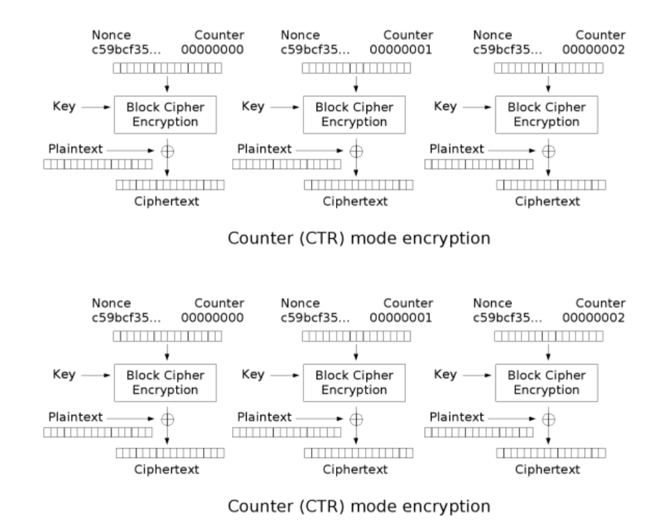

# A3S_C1R

Souce code của chall như sau:

```
from Crypto.Cipher import AES
from Crypto.Util import Counter
from Crypto import Random

flag = b'KCSC{s0m3_r3ad4ble_5tr1ng_like_7his}'
nonce = Random.get_random_bytes(8)
countf = Counter.new(64, nonce)
key = Random.get_random_bytes(32)

encrypto = AES.new(key, AES.MODE_CTR, counter=countf)
encrypted = encrypto.encrypt(b"TODO:\n - ADD HARDER CHALLENGE IN CRYPTO\n - ADD FLAG TO THE CHALLENGE\n")

encrypto = AES.new(key, AES.MODE_CTR, counter=countf)
encrypted2 = encrypto.encrypt(flag)

print(f"encrypted: {encrypted.hex()}")
print(f"encrypted2: {encrypted2.hex()}")

# encrypted: 5e07dfa19e2b256c205df16b349c0863a15839d056ada1fb425449f2f9af9563eccca6d15cb01aabbe338c851f7b163982127033787fff49e74e3e09f0aee048a1d5b29f5a
# encrypted2: 410bc8addf6036125f5fe17d4bb61c00ba565a9e71d1bf846f625eeac5bfa972f9e7c4fd60800ac9aa689f9b280f5a09fd3768674401ac60
```

Ta thấy chall này dùng mode CTR cho AES, ta có được sơ đồ mã hóa và giải mã như sau



Ta thấy cả 2 ciphertext encrypted và encrypted2 đều được mã hóa từ 1 key và 1 nonce, thế nên rằng ``xor(plaintext,encrypted)`` và ``xor(plaintext2,encrypted2)`` sẽ đều ra chung 1 kết quả

Mà chall có cho ta được plaintext rồi, thế nên giờ mình chỉ cần ``xor(xor(plaintext,encrypted),encrypted2)`` là sẽ thu được flag


Giờ thì giải bài thôi nào

```
from pwn import*
from Crypto.Cipher import AES
from Crypto.Util import Counter

plaintext = b"TODO:\n - ADD HARDER CHALLENGE IN CRYPTO\n - ADD FLAG TO THE CHALLENGE\n"
encrypted = bytes.fromhex("5e07dfa19e2b256c205df16b349c0863a15839d056ada1fb425449f2f9af9563eccca6d15cb01aabbe338c851f7b163982127033787fff49e74e3e09f0aee048a1d5b29f5a")
encrypted2 = bytes.fromhex("410bc8addf6036125f5fe17d4bb61c00ba565a9e71d1bf846f625eeac5bfa972f9e7c4fd60800ac9aa689f9b280f5a09fd3768674401ac60")

print(xor(xor(plaintext,encrypted),encrypted2))

```

**Flag: KCSC{A3S_CTR_bU1_K1nd4_3asY_y0u_5h0uld_h4v3_s0lv3d_th1s}**