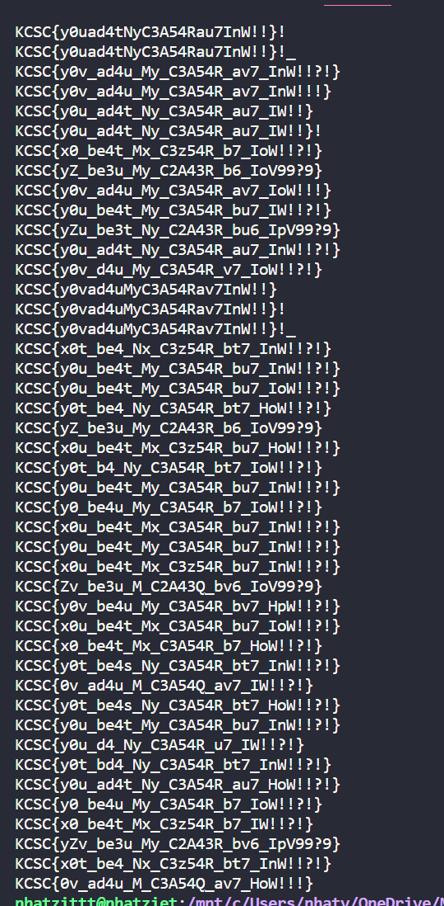
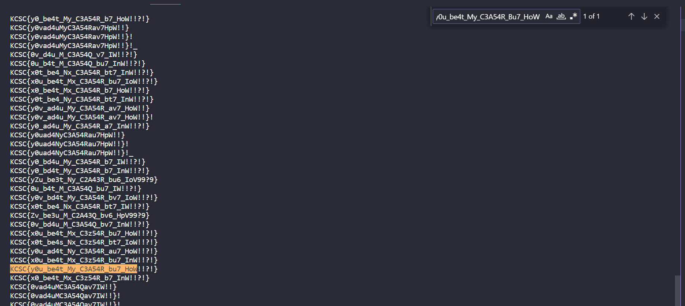

# Ceasar_but_Harder!!!!

```
import string
import random

flag = "KCSC{s0m3_r3ad4ble_5tr1ng_like_7his}" 

alphabet = string.ascii_letters + string.digits + "!{_}?"
assert all(i in alphabet for i in flag)


for i in range(3):
    k = random.randint(0, len(alphabet))
    alphabet = alphabet[:k] + alphabet[k+1:]

key = random.randint(0, 2**512)

ct = ""
for i in flag:
    ct += (alphabet[(alphabet.index(i) + key) % len(alphabet)])

print(f"{ct=}")

# ct='2V9VnRcNosvgMo4RoVfThg8osNjo0G}mmqmp'
```

Cũng là bài Caesar nhưng mà giờ mình bị thiếu mất 3 ký tự. 
Cũng làm như bài trước, nhưng mà giờ các các ký tự sẽ bị thay đổi vị trí vì bị mất đi 3 ký tự.

Ví dụ như là ký tự ``2`` thì sau khi mình thử alphabet.index("2") thì có thể là 51, 52, 53.

Ký tự ``K`` cũng thế, cũng sẽ bị thay đổi

Giờ mình sẽ lấy vị trí ký tự 2 là 51 và ký tự K là 33 đi nha. Theo như bài trước thì ta sẽ tìm được key là 18, thế nhưng vì như trên nên là mình sẽ để key ở trong 1 khoảng là từ 15 tới 25 cho chắc nha

Ngoài ra mình cũng sẽ thử hết các trường hợp của alphabet để có thể tìm được alphabet đúng nha

Vòng lặp mình sử dụng là 10000 thui, nếu bạn thích thì có thể lấy nhiều hơn


```
import string
import random

list_alpha = []

for count in range(10000):
    alphabet = string.ascii_letters + string.digits + "!{_}?"
    for i in range(3):
        k = random.randint(0, len(alphabet))
        alphabet = alphabet[:k] + alphabet[k+1:]
    if alphabet not in list_alpha:
        list_alpha.append(alphabet)
        for key in range(10,20):
            ct = '2V9VnRcNosvgMo4RoVfThg8osNjo0G}mmqmp'
            flag = ""
            for char in ct:
                if char not in alphabet:
                    continue
                flag += alphabet[(alphabet.index(char) - key) % len(alphabet)]
                if 'KCSC{' in flag and "}" in flag:
                    print(flag)
                 
```



Nhìn output thì mình đoán được flag sẽ có ``y0u``, ``be4t``, ``My``, ``C3A54R``, ``bu7``, ``HoW``, thế nên mình sẽ Ctrl F để xem dự đoán có đúng không nha




Lụm flag thôi

**Flag: KCSC{y0u_be4t_My_C3A54R_bu7_HoW!!?!}**