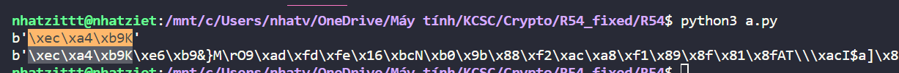
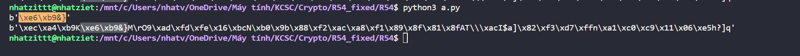

# R54

Chall đưa cho ta source code như sau
```
from Crypto.Util.number import * 
import hashlib

p = getPrime(1024) 
q = getPrime(1024) 
n = p*q 
print(n)
e = 65537

flag = b'KCSC{s0m3_r3ad4ble_5tr1ng_like_7his}'

m = len(flag) 
if m%2: 
    flag+= bytes(0x01) 


def dbytes2int(b): 
    return b[0]*256+b[1] 


ciphertxt = b''
for i in range(0, len(flag), 2): 
    plt = dbytes2int(flag[i:i+2])
    c = pow(plt,e,n)
    # print(c) 
    h = hashlib.sha256(long_to_bytes(c)).hexdigest()
    k = bytes.fromhex(h[:8])
    # print(h)
    ciphertxt += k

# print(ciphertxt)
with open("./Chall_med_4/enc_msg.bin", "wb") as f: 
    f.write(ciphertxt)

# n = 20675528040670526996752940893288629654073674678976458593562885254372323957903532876778575683971980608430988271483012687068546409103618011471627912308716870404710200387846081948584012645579489130659361868569525868828863142513688732813453572263121568340255562594977295513766156580889393986895191199436845252360294885224181350174035317346113446210888214332389015986819447524673296950196284975878585211748477505072532061859389809017849787533731620947172314201145532242513117285325664785809436379731158841381092296256976553945301076520532403729003821419792192809111636400447743715443579056636708987896016462504011033448823
    

```

Cùng với đó là 1 file ``enc_msg_fixed.bin``.

Đọc source thì ta thấy rằng, đoạn code này sẽ lấy lần lượt 2 ký tự của flag, sau đó sẽ mã hóa RSA với public key, rồi sẽ sử dụng hàm băm sha256 rồi lấy 4 bytes đầu tiên.

Giờ mình thử với "KC" và "SC" coi sao nha
```
from Crypto.Util.number import * 

import hashlib
n = 20675528040670526996752940893288629654073674678976458593562885254372323957903532876778575683971980608430988271483012687068546409103618011471627912308716870404710200387846081948584012645579489130659361868569525868828863142513688732813453572263121568340255562594977295513766156580889393986895191199436845252360294885224181350174035317346113446210888214332389015986819447524673296950196284975878585211748477505072532061859389809017849787533731620947172314201145532242513117285325664785809436379731158841381092296256976553945301076520532403729003821419792192809111636400447743715443579056636708987896016462504011033448823

e = 65537

with open("enc_msg_fixed.bin","rb") as file:
    output = file.read()


def dbytes2int(b): 
    return b[0]*256+b[1] 

plt = dbytes2int(b"KC")
c = pow(plt,e,n)
h = hashlib.sha256(long_to_bytes(c)).hexdigest()
k = bytes.fromhex(h[:8])
print(k)
print(output)
```

Sau khi chạy code thì sẽ thấy rằng 4 byte đầu tiên sẽ là mã hóa cho b"KC"



Thử tiếp với b"SC" thì thu được kết quả tương tự



Thế nên giờ mình sẽ bruteforce 2 ký tự một, sao cho bằng 4 bytes đầu của output, nếu đúng thì sẽ xóa đi 4 bytes đầu để tiếp tục brute 2 ký tự tiếp theo cho tới khi độ dài output = 0

Mình code như sau
```
from Crypto.Util.number import * 

import hashlib
n = 20675528040670526996752940893288629654073674678976458593562885254372323957903532876778575683971980608430988271483012687068546409103618011471627912308716870404710200387846081948584012645579489130659361868569525868828863142513688732813453572263121568340255562594977295513766156580889393986895191199436845252360294885224181350174035317346113446210888214332389015986819447524673296950196284975878585211748477505072532061859389809017849787533731620947172314201145532242513117285325664785809436379731158841381092296256976553945301076520532403729003821419792192809111636400447743715443579056636708987896016462504011033448823

e = 65537

with open("enc_msg_fixed.bin","rb") as file:
    output = file.read()


def dbytes2int(b): 
    return b[0]*256+b[1] 


flag = b''
while len(output) != 0:
    for i in range(256):
        for j in range(256):
            a = long_to_bytes(i) + long_to_bytes(j)
            plt = dbytes2int(a)
            c = pow(plt,e,n)
            h = hashlib.sha256(long_to_bytes(c)).hexdigest()
            k = bytes.fromhex(h[:8])
            if k == output[:4]:
                flag += a
                output = output[4:]
                print(len(output))
print(flag)
```

**Flag: KCSC{r54_!5_51Mp|3_r1gH+?}**