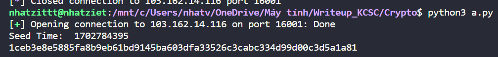
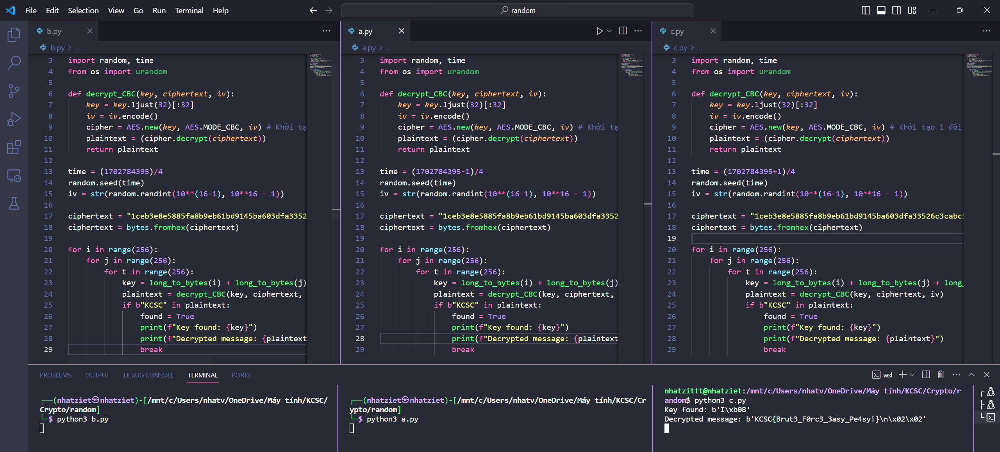

# random

Source code của chall như sau
```
from cryptography.hazmat.backends import default_backend
from cryptography.hazmat.primitives import padding
from cryptography.hazmat.primitives.ciphers import Cipher, algorithms, modes
import random, time
import struct

with open('flag.txt', 'r') as f:
    FLAG = f.read()

def aes_encrypt(key, plaintext, iv):
    key = key.ljust(32)[:32]
    plaintext = plaintext.encode()
    iv = iv.encode()

    padder = padding.PKCS7(128).padder()
    padded_plaintext = padder.update(plaintext) + padder.finalize()

    cipher = Cipher(algorithms.AES(key), modes.CBC(iv), backend=default_backend())
    encryptor = cipher.encryptor()

    ciphertext = encryptor.update(padded_plaintext) + encryptor.finalize()

    return ciphertext

def aes_decrypt(key, ciphertext, iv):
    key = key.ljust(32)[:32]
    iv = iv.encode()

    cipher = Cipher(algorithms.AES(key), modes.CBC(iv), backend=default_backend())
    decryptor = cipher.decryptor()

    padded_plaintext = decryptor.update(ciphertext) + decryptor.finalize()

    unpadder = padding.PKCS7(128).unpadder()
    plaintext = unpadder.update(padded_plaintext) + unpadder.finalize()

    return plaintext.decode()


random.seed(int(time.time()/4))

iv = str(random.randint(10**(16-1), 10**16 - 1))
with open('/dev/random', 'rb') as f:
    num = int.from_bytes(f.read(3), byteorder='little')

random.seed(num)

num = (num >> 1 << 1) | random.choice([0,1])
key = num.to_bytes(3, byteorder='little')
cipher_text = aes_encrypt(key, FLAG, iv)
cipher_text = ' '.join(f'{byte:02x}' for byte in struct.unpack(f'{len(cipher_text)}B', cipher_text))
print('cipher text:', cipher_text)
exit(0)
```

Ta phân tích qua thì thấy đây là mã hóa AES.CBC với iv được random với seed là ``int(time.time()/4)`` cùng với key là 1 đoạn byte có độ dài là 3

Trước tiên là mình phải lấy được time lúc nc cùng với dữ liệu được mã hóa trên server trước đã.

```
from pwn import*
import random, time

io = remote("103.162.14.116", 16001)

print("Seed Time: ", int(time.time()))

io.recvuntil(b"cipher text: ")

data = io.recvuntil(b"\n").decode()
print(data.replace(" ",""))
```



Ta có ``time = 1702784395`` và ``ciphertext = "1ceb3e8e5885fa8b9eb61bd9145ba603dfa33526c3cabc334d99d00c3d5a1a81"``

Hiện giờ là mình đã có time và ciphertext rồi, mình sẽ viết lại hàm decrypt. Mình không quen dùng thư viện như source của chall nên là mình viết kiểu khác nha.

```
def decrypt_CBC(key, ciphertext, iv):
    key = key.ljust(32)[:32]
    iv = iv.encode()
    cipher = AES.new(key, AES.MODE_CBC, iv) # Khởi tạo 1 đối tượng AES với key và iv
    plaintext = (cipher.decrypt(ciphertext))
    return plaintext
```

Giờ mình sẽ tìm lại giá trị của iv nha
```
time = (1702784395)/4
random.seed(time)
iv = str(random.randint(10**(16-1), 10**16 - 1))
```

Key vì chỉ có 3 byte, mình sẽ bruteforce hết tất cả các trường hợp nên lồng 3 for cho nó dễ hiểu nha.

Đoạn code giải sẽ như sau
```
from Crypto.Util.number import*
from Crypto.Cipher import AES
import random, time
from os import urandom

def decrypt_CBC(key, ciphertext, iv):
    key = key.ljust(32)[:32]
    iv = iv.encode()
    cipher = AES.new(key, AES.MODE_CBC, iv) # Khởi tạo 1 đối tượng AES với key và iv
    plaintext = (cipher.decrypt(ciphertext))
    return plaintext

time = (1702784395)/4
random.seed(time)
iv = str(random.randint(10**(16-1), 10**16 - 1))

ciphertext = "1ceb3e8e5885fa8b9eb61bd9145ba603dfa33526c3cabc334d99d00c3d5a1a81"
ciphertext = bytes.fromhex(ciphertext)

for i in range(256):
    for j in range(256):
        for t in range(256):
            key = long_to_bytes(i) + long_to_bytes(j) + long_to_bytes(t)
            plaintext = decrypt_CBC(key, ciphertext, iv)
            if b"KCSC" in plaintext:
                found = True
                print(f"Key found: {key}")
                print(f"Decrypted message: {plaintext}")
                break
```

Nhưng mà khi nc thì sẽ bị lệch thời gian tầm vài giây thế nên là mình phải bù trừ vào thì mới thu được iv đúng. Mình muốn nhanh nên là chạy phát 3 code với time lần lượt là ``time = (1702784395)/4``, ``time = (1702784395+1)/4``, ``time = (1702784395-1)/4``.



Nếu bạn chạy không ra thì chỉnh lại phần bù trừ nha

**Flag: KCSC{Brut3_F0rc3_3asy_Pe4sy!}**