# Hidden in the Base

Bài này khá là giống bài [NetLab2](https://hackmd.io/AwOOf6ljRd-WUmZnP-6l1w) trên Viblo, mình cũng có từng làm bài này rồi nên mọi người có thể tham khảo nha.


Chall cho mình 1 file .pcap, mình mở lên bằng wireshark thôi

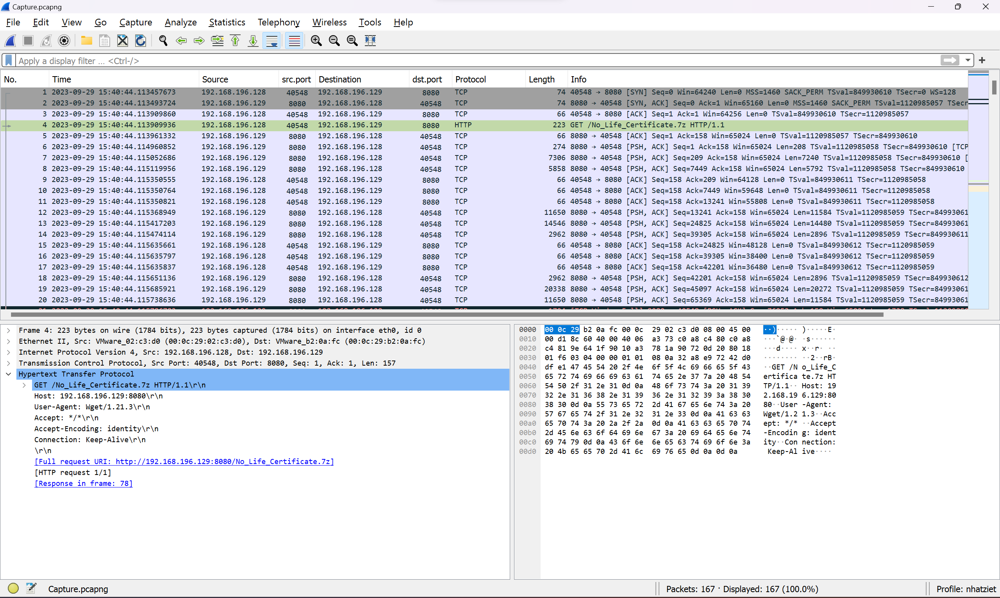

Mình thử lọc http thì có 2 packet, và trong đó có 1 file 7z

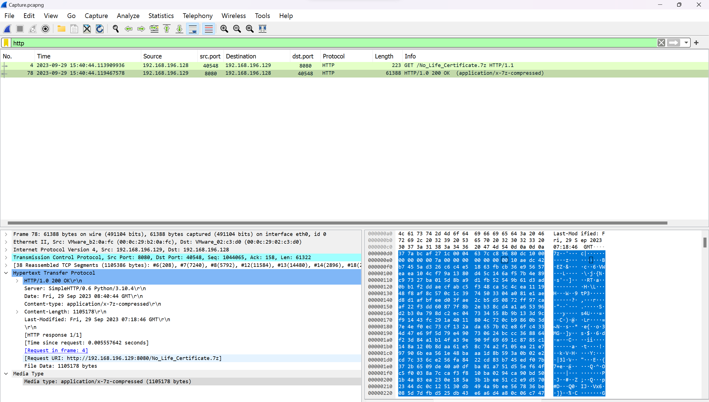

Mình sẽ export file đó ra nha

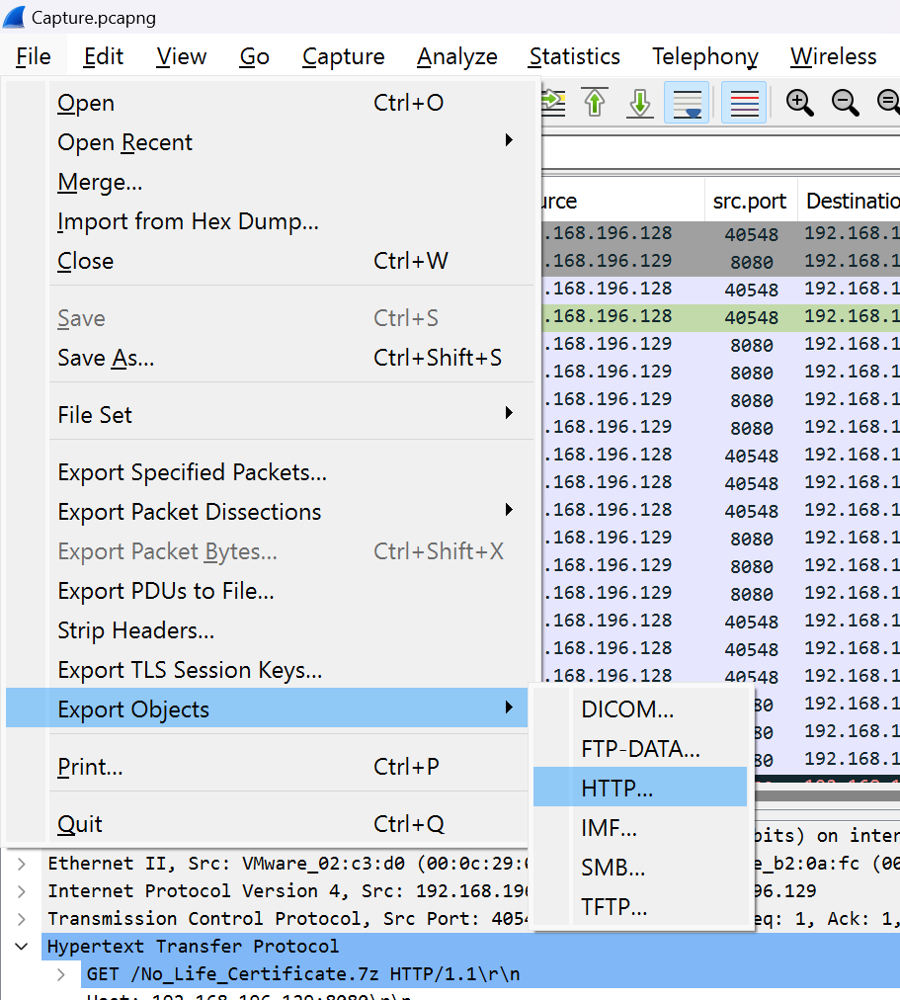

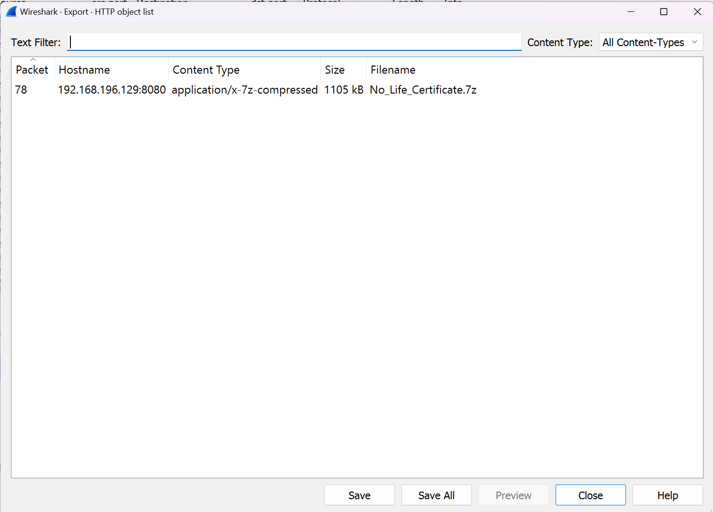

Mình mở thử file ``No_Life_Certificate.7z`` thì phải có password huhuhuh

Mình giờ lại coi coi xem còn manh mối nào không.

Mình thấy máy chủ DNS 192.168.196.128 đang nhận rất nhiều các lệnh truy vấn


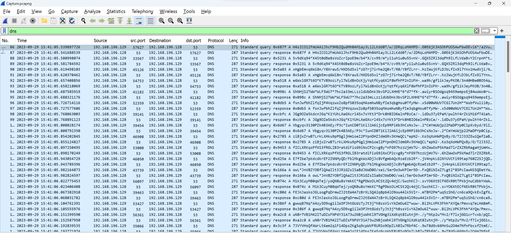

Mà các Queries này nhìn rất giống base64, thế nên mình sẽ lấy hết các lệnh truy vấn này nha

Giờ mình sẽ lọc theo command như sau ``dns && ip.dst == 192.168.196.128``

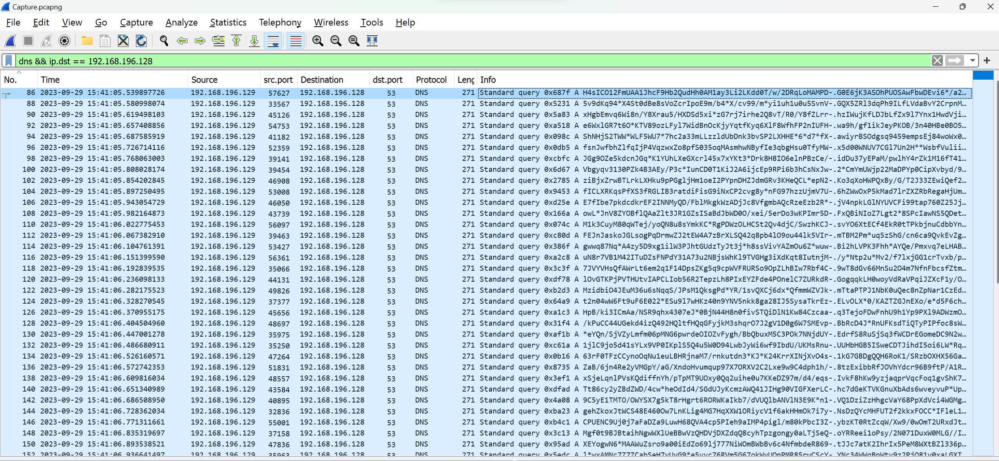

Giờ mình sẽ lấy code python để lấy ra thôi

```
from scapy.all import DNS, DNSQR, IP, rdpcap

def process_packet(packet):
    if packet.haslayer(DNS):
        dns_packet = packet.getlayer(DNS)
        if dns_packet.haslayer(DNSQR) and packet[IP].dst == '192.168.196.128':
            query = dns_packet[DNSQR].qname.decode()
            if query is not None:
                return query

packets = rdpcap('Capture.pcapng')
for packet in packets:
    query = process_packet(packet)
    if query:
        print(query)
```

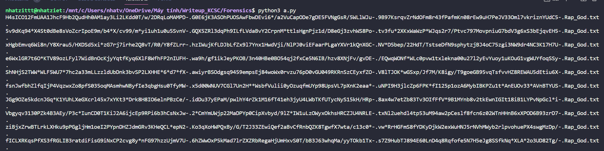

Giá trị của 1 packet đầu là ``H4sICO12FmUAA1JhcF9Hb2QudHh0AM1ay3Li2LKdd0T/w/2DRqLoMAMPD-.G0E6jK3ASOhPUOSAwFbwDEvi6*/a2VuCapODe7gDE5FVNgGsR/5WLlWJu-.9B97KsrqvZrNdOFm8r43fPafmKn08rEw9uH7PeJV33Oml7vkriznYUdC5-.Rap_God.txt.``

Như trong bài Netlab2 của mình thì mình split("-."), thế nhưng hơi mất công nên là mình sẽ remove hết các ký tự lạ và cả ``Rap_God.txt`` nữa nha.

Ngoài ra thì dấu * sẽ thay bằng dấu + vì base 64 chỉ có dấu + và / thôi nha

Và tất cả các giá trị này đều thuộc về file ``Rap_God.txt`` nha

Giờ mình sẽ sửa lại code như sau

```
from scapy.all import DNS, DNSQR, IP, rdpcap

def process_packet(packet):
    if packet.haslayer(DNS):
        dns_packet = packet.getlayer(DNS)
        if dns_packet.haslayer(DNSQR) and packet[IP].dst == '192.168.196.128':
            query = dns_packet[DNSQR].qname.decode()
            if query is not None:
                temp = query.replace("Rap_God.txt","")
                temp = temp.replace(".","")
                temp = temp.replace("-","")
                temp = temp.replace("*","+")
                return (temp)

rap_god_b64 = ""

packets = rdpcap('Capture.pcapng')
for packet in packets:
    query = process_packet(packet)
    if query:
        rap_god_b64+=(query)
print(rap_god_b64)
```

```
H4sICO12FmUAA1JhcF9Hb2QudHh0AM1ay3Li2LKdd0T/w/2DRqLoMAMPDG0E6jK3ASOhPUOSAwFbwDEvi6+/a2VuCapODe7gDE5FVNgGsR/5WLlWJu9B97KsrqvZrNdOFm8r43fPafmKn08rEw9uH7PeJV33Oml7vkriznYUdC55v9dKq94+X4St0dBe8sVoZcrIpoE9m/b4+X/cv99/m+yi1uh1u0u5SvnVGQX5ZRl3dqPh9ILfLVdaBvY2CrpnM+ttlsHgnPjz1d/D8eGj3zvhWS8Potv3fu+2XKxWaWzP+WJqs2r7/Ptvc797MovpniuG7bdV3g6xS3bEjqvEH5xHgbEmvq6Wi8n/Y8Xrau5/HXDSd5xi+zG7rj7irhe2Q8vT/R0/Y8fZLrrhzIWujKfLDJbLfZx9l7Ynx1HwdVji/NlPJ0viEFaarPLgaYXVr1kQnXGCNV+D5bep/22HdT/TstseDfN9sphytzjBJ4oC75zgi3NW9dr4NC3K17H7Ue6WxlGR7t6O+KTV89ozLFyl7WidBnOcKjyYqtfKyq6XlF8WfhFP2nIUFHwa9h/gf1ikJeyPKOB/3n40HBe0BO54qj2fxCe5N6IB/hzv8XNjFv/gvDE/EQwqWONf+WLc0pvw1txlekna00u27l2yEvYuoy1uKOuG1vgWUYfoqSSyShNHjS2TWW+WLF5WU7+7hc2a33mLLzzldUbDnk3bvSP2LXHHE+6+d7+fXawiyrBSOdgsq9459empsEj84woWx0rvzu76pD0vGU049RKRnSzCEyxfZOV8lTJOK+wGSxp/Jf7M/K8igy/T9goeGB95vqTsfvvHZ8REWAU5dEtiu6XfsnJwfbhZlfqIjP4VqzwxZo8pfS035oqMAsmhwNByfIe3qbgHsu0TfyMWx5d00WNUV7CGl7Un2H++WsbfVulii0yOzuqfmUYp98UpsVL7pXnK2eaa+uNPI9H3jlcZp6FPK+fI125p1ozA6MybIBKPZu1t+AnEUOv33+AVnBTYUSJGg9OZe5kdcnJGq+K1YUhLXeGXcrl45x7xYKt3+Drk8H8IO6elnPBzCe/idDu37yEPaM/pwlhY4rZk1M16fT41eh3jyU4LWbTKfUTycNyS15kH/HRp8ax4w7etZb83Tv3OIfFfV+9B1MYnb8v2tkEwnIGIt18iB1LYPvNpGcl+iVbgyqv3130PZk4B3AEy/P3c+IunCD0T1KiJ2A6ijcEp9RPi6b3hCsNxJw2+CmYmUWjp22MaDPYp0CipXvbyd/9lZ+IW1uLzOWyxOkhsHRCZJU4NRLEtxNl2uehdl4tp53uM94aw2pCeslf8fcn6z02WTnHHnB6xXPOD6B93zrD7ziBjxZrwBTLrkLXHku9pPGgljHm1oeI2PYpnDHZJdmGRv3KHeQCL+epN2Ko3qXoHWPQxBy/G/T2J33ZEwiQef2aBvCfRnbQZK8TgwfX7wta/c13c0+vw+RrHGFmS8fYDKyDjkW2exWuHNJ5rNVhMWyb2rlpvohuePX4swgMzDp/fICLXRKqsPfXS3fRGLIB3ratdiFisG9iNxCP2cvg8y+nFG97hzzUjmV7U6hZWwOxP5kMad7lrZXZRbRegaHjUmHxvS0T/bB3J63whqMa/yyTOkb1Txs7Z9HubTJ894E60LnD4q8Rqfofe5N7H5eJg8SSfkNq+XLA+2o3UD82Tg/E7fIbe7pkdcdkrEF2INNMyQD/FblMkgkWzADjJc8VfgmbAQcRzeEzb2R+jV4npkLGlNYUVCFi99tap760Z25JjQDjGG87POJK75sMp0PjE2CmlOlY14gI3fGEMsGPWoK4lEl4NPKhYXuDc812m8VZ8IN6TeMbzLibyKk7vuThHhowL+JnV8ZYOBflQAaZlt3JR1GZsISaBdJbWD0O/xei/5erDo3wKPImr5DFxQBiNIoZ7Lgt2+8SPcIawNS5QDetYWps4Rz51JKdYP5xNgGAny1vSAqPX/GIQ8c3vklf/5fXum0RzQPRj9o33iAplEYFXEFFQA8+Ptsr8grFZMKs0M1k3CuyM80qWTej/yoQN8u8sYmkKC+RgPDWzOLHCSt2Qv4djC/SwzhKCJsvYO6XtECf4EkR0tTPkbjnuCdbbYnWAb2F13pIVNAeCY8Uyj69up/CYxxHQAJyxn0v+oPJKviE7rctMcOUIdzEevGo/htEacYrTje1Pdwi+LjmqhqDFEJnJaskoJGLsogPqDrmwZJ2tEW4A7zBrXLSQ42q8pb4lO9ou44lk5VIrmTBM2Pm+uq5zShG/cn6ca9QvkEvZgfX4jfkiNSAPBp8G7EB9Dm/63br2CPvEcyfE9SFpP/8Y5Sv5yTNLpXtd4ZZA0/HRsRec6c15Ktx/AKldPBJPgqgwwq87Nq+A4zy5D9xg1ilW3PJhtGUdzTyJt3j+h8ssVivYAZmOu6Z+wuwBi2hLVPK3Fhh+AYQe/Pmxvq7eLHABmPS+7iy+b1/JIsCO54Im8Ohr6oNRD0Kb4tkYfDQN+ExUfOy2Gp1x51PUz0yj48OxK1ERRvgCmAXqMrAYto/BnuN8r7VB1M42ITuDZsFNPdY31A73u2NBjsWhKl9TVGHg3iXdKqt8IutnjM/y+Ntp2u+Mv2/f7lxjGG1crTvxb/pQI9i75IKWxgPeom5ksFJXUALRMkvJ9V6LIg2uYsFpOTiZrM4+reGKBKIX469PpzX2ot6GUUWGoKcIvWwHDSAc7JVYVHsQfAWrLt6em2q1F14DpsZKg5q9cpWVFRURSo9OpZLhBIw7Rbf4C9wT8dGv66MnSu2O4m7NfnFbcsfZtmE/pjCKeLWGkirBW5MByUr9HLh+fbgnee3XRTAUlsHvOGl04x1MKdUJHI6rye2HUys2xF1yXxRcw4CEBTh8VY0lOvGTKPjPVTHUtvIAPCLIob56R2TepzLh8PIxEYZFde4POnelC7ZURkdRGogqqkLH0woyVdRaVPqiJZXcF1y/OCYCHG/sItndscL4EBmwxSlZjG/f4+4maUeVnIy4yW7AjucHiwAnLOqnmwjA2YTxOLQvRBOT4/5y79G2C0Q39kMzidbiO4JEuM36u6sNqqS/JPsM1QksgPd+YR/1svQXCj6dx+QfmmWZVJkmTtaPTPJ1NbK0uQec8nZpNar1CzEdyEyWTmUa+cB0IPhU1PG/32gWRP9+Mt5OY0G6Kb88/fuT02lE4GT2ssZKzIQO+Nx+tHb1/nUKjf3LfaFQ4Ic2at2n04wW6Ft9uF6E022+ESu9l7wHKz40n9YNV5nkk8ga28IJ5SysaTkrEzELvOLX+0/KAZTZGJnEXo/e+d5F6chZqCXBfwrqfnDJAv5gl0LQIIH6iWymtYs42IaW2TtPOVbfYxSxO4DKoAgG9tH5D/Gsl/8sz4qkykkWC4sUzi6+HpB/ki3ICmAa/NSR9qhx4307eJ+0BjN44H8n0fivSTQiDlN1Kw84Czcaaq3TejoFDwFnhU9h1Yp9PXl9ADWzmOIn3l+M9/ebzsj+Y1aeqEzpo9ccXA85jNfiUvotTuf1jsA1K6zn9YR46lFtH9kTAu+/Id8r2nGyGCNjw60ilHK/kPuCC44UGekd4izQ492HQltfHQqGFyjkM3shqrO7J2gV1D0g6W7SMEvpBbRcD4J+RnUFKsdTiQTyPIPfoc8sWfpdq4rmczpEfZEHYEnwhct99mZQTUTZaKeL1aeNGLPpqlH/99ricnYK/Sxe9/AJWXdZ9wiBe2mgEboUXiPV5U+eYQn/SjVZyLmfm06pMNG6pwrdeOIOZvFygh/BbQbuxM5C3POk7NNjdUYEdrfS8RuSjSq3fWCDrEGomeDC9N2whwyaHhULdMXX1TTokq+eklieID/c63nCGyxdPtR7VJyWq3Y9RjgYolcY5uYQuQvt1Oivk6AF6xKZz2IMBZ+z31jlC9jo5d41sYLx9VP0IKplS5Q4u5W0D94LwbJyWi6wf9IbdU/UKMsRnuUUHbHGB5ISweCDTJihdI5oi6LW+Rqvs3sXBPc/UUl4rHLazc1Rc5requgXVr6E8QGsZL8iD5hbjKMxKl9IVHNcaPpg6WnDBJX9ZtrzRKW1a8eQW9lu63rF0TFzCCynoOqNu1euLBHRjnaM7/rnkutdn3+KJ+K24KrrXINjXvO4s1kG7GBDgQQH6RoK1/SRzbOXHX56Gaq1Ud4nFStnpyzOz6gVv1LqQ+BZO+z8gMzSnZ7Xeusg+BF8eYwqUfEu9urO91RtDMQULa8dHFZNK2pUPRdSqVFZaB/6jn4Re2yVMGpY/aG/XndoHvumqup97X7ORXV2C2Lxe9w9C4dph1h/8tzExibbRfJOVhYdcr96B9ftP/A1RhRVk2Lf+JLGXIXVbbKg7waPGooR9qlW7x6JkLwLJxLmZxYDtKUmteyViTaQfpL0VaOO7iNVpOM6VBfs50dnnKxSjeLqnlPVsKQdiffnYh/pTpMT9UOxy0Qq2uihe0u7KKeDZ97m/d4/eqsIvkF8hKw9yzjaqprVqcFoq1gvShK7uFjCjdnFMsAz7ISbk52BnTALh4jaPmrQTNm4Uz/s7lre3ATIZbw2mR9P47+yo3aFIh+6RZmMY3EyS5iNxHfRHTt86cy2yZBdZWD/4cw+heOdId4/SGdUJyKcmzAWQ41JIHg90VIGFXerLChc7dGeKTVKGnuXbAds6wveyvuP+Up7ZkG3gmWO6mdhSGDqeTz+rDWT63PhvOG1ttfb5uU67jc67PlevWpkXPodqkhFRcdYZFXne1dtBXuE6a3qWNMz9C5yE1TMTO/OWYSX7g5kT8rHgrt6RORWKaIkb7/dVUQlbANVlN3E9K+n1VQ1DziZzHhgcVaY68PpXdVci4WGMgFADcjImDrf49xL1z9yMOA/sfk+k6Ptaeu6CwP22mUV7yRN7GtmQtOCB0Bpa7duq9OW7Wq2JupPfuhlQC2t6+ygehZkoxJtWCS48E460Ow7LnKLig4MG7HqXXW1ORiycV1f6akHHmOk7i7yNsDzQYcMHFUT2f2kkxFOCC+IFleL1XvSt8W+b5vJZVz1bkBgMEp2sRtFs9Hesk5Tge9HRTDgNfTiHiuQZbGPEhZA8/0jk4W1t8v4iX3wQroNTrOKhhCPUENC9Uj0j7aFaDZa9LuwH68QVA4cp5PIeh9aIMP4pigl/m80kPbcI3ZybzKT0RtZcqW/Xw9/0wOmT2URxdJthOZGdkPNw6tb4AYnR3zt6FAOFX7scZfQsTw8R/VXKIeL/DrL8wt7ztKrvs+iD9IzGYb3To3r7yj3Axugph1G9Mgf0t9BJBtaihNgwWXlUeBBwVzQHDVjDXZdqQ8cyhTpzgongy0aLTjSeQoYRReei1oPsy/2N071DuxW0MLG//IcX+AaDYebQmWxJziQvjT8chJmLx2rb1LPoe22BgiV7qQzIM+53r7a4kDeSBYE9s2KLPjhdItnAmulayjR38zMXEYogwN6+MAAWuZsro9a00iEdZo69lj777NiWOmBWbBv6c4NfmbdeR869tJJc7atK2IhrIx5PeM8WXtBZl336pr+0gbvWZldNWd97GU6NNUsoJeaaNGJnMx2FowBnWc75gjeZuRV8bH2SavrvRtOZoV94amW1P1FBGalHbGVdCDl+wxAMNc7Z7ZCabSeH7vUvG9+e5yyc76RVm5G67okWvUOnPMR85ruCScYYNc34WWqBpWty9z2PjO81v0xaLGXI6rzJlnIp0JWj9xVXDLVlDWrsZER/ojP3ueuFWfF3xWbm0mfq8Tst+q8vGI9JjN7D7rcx7D3kuHWnBQxZoDan+SoYn99pr7Bz9+loBqo+bUy+ktaCgeVCbzY8NefrK2K+maGb8LGGRMPEw6ZcGfCTlnz8clL4gMjdvo0fS2IcyBbVwQJZSYrdVO+PSF9YDcLFZuyrwSe9IZqbvX3mdTgOsPVExt+84bTlKyq1bI9QwPzEy32xqmc2IvLNTfrT8v0DlhIdVGKTW+PGgFRWJFBK3+cEwfLeZ1XB1OrAF+Yp8wblSVxlj4/1qo1Y1y132oGrHkYUxEZPoedbcV6KLrHf/pjNIj2REc3YQgM+CC7oXPVn2SB4N1L39paJbIKH1d3tBhsyJ9xf1v3hjOyk+BLNaZMDzllmN6nCKcP+DINklq51wphz6ehvjQi1rnODOunV6F/RwaNQsFll3OqQrOhxAe86x10JvV05zk6p+A7ZN9UH+wMtCMrU8qy67vuKr+7cBS+5b5tkbV7yOCjMOKcccPPXH9WzqjbB2Xc+oQyyTF4T8S8czwQfnrQ/JxhcpIxvowGuB1nSq5j62a/yvVKjXQTX4/1PTL/i70JdyZ5FhneackETvIeZztlioEjaB+fcxXHz3T6X3Y7jOH63FDU0IanjvNKyZMp13C3PKtlC+26OL0oN3/4xtXP3//Kh9GOEWfct0t0bpvv0gbx4R2gCePFaJ/caTTDOiavy5mb3VwfV2uNm0U6reQ0rX7vJ68kfx1XFo3GTiS/OYbsZZdKECmeP6jYHH9HZ2AvfDG/37x0DKel9UVnOjKF9u2WE8ZHvgal2NLvA2EVVA7Tb2ad7my1pkcUd7QTS17l5g7DHldj380pKqgZ9kHa9sTuubITh4mqYg+wsZ5g9VxHu9Pj5JLNbDaYHrQ7wtwg8+iem284eeybol7IN7+MzvM5ZdvqFEFVrPKWt2NdRZE/J8Sc8C3u4PavbeYiIZTvRA3UJq6HR63A7uMycJ2HWieBXWrGRdeM1SWeuImw5Lubqb1y3frvs85tpk6Bwbc3p3n3nDrK3LVfvCfsdq23D99L4DyGGpCIQDvxRss4+WEupN+ziOpvaZCzXBx6F9n1bm39NFibD7RtokG6SaW9yokRoapJdNqhFlxKnBg38/vW/E2spvXv90qUFYKLTXVG7+KGMwBze1pFbp7GjqNUvs4PTzS8RDy5IRt1Kw5Tf/LH/wHRKP03iioAAA==
```

Giờ thì mình sẽ lên cyberchef decode base64 này nha và save về

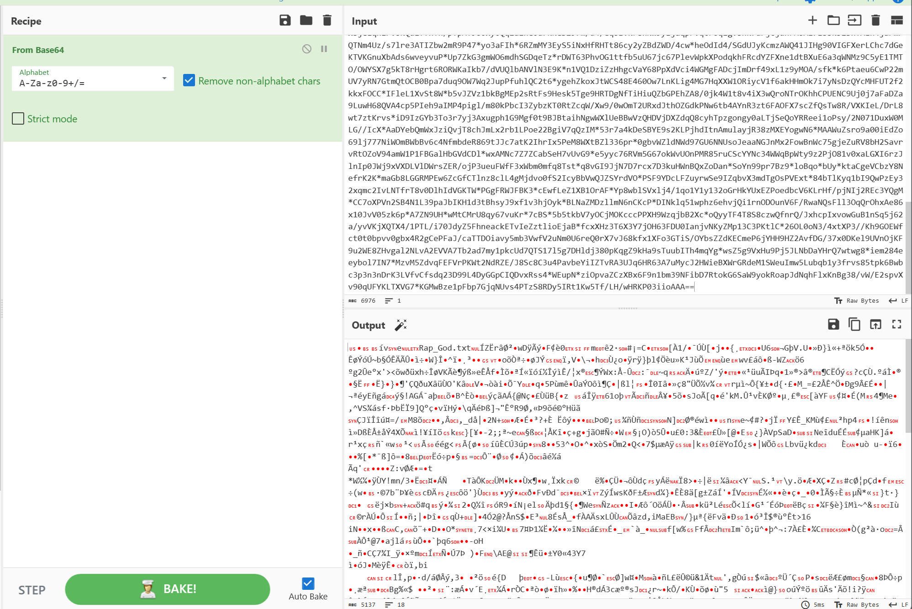


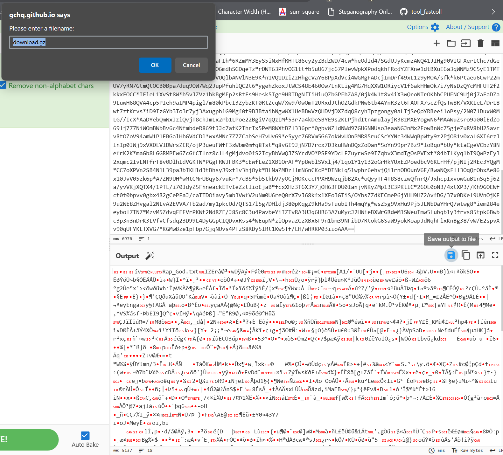

Thì đây là 1 file gzip, mình sẽ giải nén ra thôi.

Mình thu được 1 đống b64 như sau

```
TG9vaywgSSB3YXMgZ29ubmEgZ28gZWFzeSBvbiB5b3UgYW5kIG5vdCB0byBodXJ0IHlvdXIgZmVlbGluZ3N=        
QnV0IEknbSBvbmx5IGdvaW5nIHRvIGdldCB0aGlzIG9uZSBjaGFuY2UgKHNpeCBtaW51dGVzLCBzaXggbWludXRlcyk=
U29tZXRoaW5nJ3Mgd3JvbmcsIEkgY2FuIGZlZWwgaXQgKHNpeCBtaW51dGVzLCBzaXggbWludXRlcywgU2xpbSBTaGFkeSwgeW91J3JlIG9uKW==
SnVzdCBhIGZlZWxpbmcgSSd2ZSBnb3QsIGxpa2Ugc29tZXRoaW5nJ3MgYWJvdXQgdG8gaGFwcGVuLCBidXQgSSBkb24ndCBrbm93IHdoYXR=
SWYgdGhhdCBtZWFucyB3aGF0IEkgdGhpbmsgaXQgbWVhbnMsIHdlJ3JlIGluIHRyb3VibGUsIGJpZyB0cm91Ymxl
QW5kIGlmIGhlIGlzIGFzIGJhbmFuYXMgYXMgeW91IHNheSwgSSdtIG5vdCB0YWtpbmcgYW55IGNoYW5jZXP=
WW91IGFyZSBqdXN0IHdoYXQgdGhlIGRvY3RvciBvcmRlcmVk
SSdtIGJlZ2lubmluZyB0byBmZWVsIGxpa2UgYSBSYXAgR29kLCBSYXAgR29k
QWxsIG15IHBlb3BsZSBmcm9tIHRoZSBmcm9udCB0byB0aGUgYmFjayBub2QsIGJhY2sgbm9k
Tm93IHdobyB0aGlua3MgdGhlaXIgYXJtcyBhcmUgbG9uZyBlbm91Z2ggdG8gc2xhcCBib3gsIHNsYXAgYm94P2==
VGhleSBzYWlkIEkgcmFwIGxpa2UgYSByb2JvdCwgc28gY2FsbCBtZSBSYXBib3R=
QnV0IGZvciBtZSB0byByYXAgbGlrZSBhIGNvbXB1dGVyIG11c3QgYmUgaW4gbXkgZ2VuZXP=
SSBnb3QgYSBsYXB0b3AgaW4gbXkgYmFjayBwb2NrZXR=
TXkgcGVuJ2xsIGdvIG9mZiB3aGVuIEkgaGFsZi1jb2NrIGl0
R290IGEgZmF0IGtub3QgZnJvbSB0aGF0IHJhcCBwcm9maXT=
TWFkZSBhIGxpdmluJyBhbmQgYSBraWxsaW4nIG9mZiBpdG==
RXZlciBzaW5jZSBCaWxsIENsaW50b24gd2FzIHN0aWxsIGluIG9mZmljZS==
V2l0aCBNb25pY2EgTGV3aW5za3kgZmVlbGluJyBvbiBoaXMgbnV0c2Fjay==
SSdtIGFuIE1DIHN0aWxsIGFzIGhvbmVzdK==
QnV0IGFzIHJ1ZGUgYW5kIGluZGVjZW50IGFzIGFsbCBoZWxsIHN5bGxhYmxlcywga2lsbGFob2xpYyAoa2lsbCAnZW0gYWxsIHdpdGgp
VGhpcyBmbGlwcGl0eSBkaXBwaXR5LWhpcHBpdHkgaGlwLWhvcC==
WW91IGRvbid0IHJlYWxseSB3YW5uYSBnZXQgaW50byBhIHBpc3NpbmcgbWF0Y2ggd2l0aCB0aGlzIHJhcHBpZHkgYnJhdE==
UGFja2luJyBhIE1BQyBpbiB0aGUgYmFjayBvZiB0aGUgQWMnLCBiYWNrcGFjayByYXAgY3JhcCwgeWFwLXlhcCwgeWFja2l0eS15YWNr
QW5kIGF0IHRoZSBleGFjdCBzYW1lIHRpbWUsIEkgYXR0ZW1wdCB0aGVzZSBseXJpY2FsIGFjcm9iYXQgc3R1bnRzIHdoaWxlIEknbSBwcmFjdGljaW4nIHRoYXR=
SSdsbCBzdGlsbCBiZSBhYmxlIHRvIGJyZWFrIGEgbW90aGVyZnVja2luJyB0YWJsZS==
T3ZlciB0aGUgYmFjayBvZiBhIGNvdXBsZSBvZiBmYWdnb3RzIGFuZCBjcmFjayBpdCBpbiBoYWxm
T25seSByZWFsaXplZCBpdCB3YXMgaXJvbmljIEkgd2FzIHNpZ25lZCB0byBBZnRlcm1hdGggYWZ0ZXIgdGhlIGZhY3R=
SG93IGNvdWxkIEkgbm90IGJsb3c/IEFsbCBJIGRvIGlzIGRyb3AgRi1ib21icywgZmVlbCBteSB3cmF0aCBvZiBhdHRhY2t=
UmFwcGVycyBhcmUgaGF2aW5nIGEgcm91Z2ggdGltZSBwZXJpb2QsIGhlcmUncyBhIE1heGlwYWS=
SXQncyBhY3R1YWxseSBkaXNhc3Ryb3VzbHkgYmFk
Rm9yIHRoZSB3YWNrLCB3aGlsZSBJJ20gbWFzdGVyZnVsbHkgY29uc3RydWN0aW5nIHRoaXMgbWFzdGVycGnoY2V=
J0NhdXNlIEknbSBiZWdpbm5pbmcgdG8gZmVlbCBsaWtlIGEgUmFwIEdvZCwgUmFwIEdvZE==
QWxsIG15IHBlb3BsZSBmcm9tIHRoZSBmcm9udCB0byB0aGUgYmFjayBub2QsIGJhY2sgbm9k
Tm93IHdobyB0aGlua3MgdGhlaXIgYXJtcyBhcmUgbG9uZyBlbm91Z2ggdG8gc2xhcCBib3gsIHNsYXAgYm94P4==
TGV0IG1lIHNob3cgeW91IG1haW50YWluaW5nIHRoaXMgc2hpdCBhaW4ndCB0aGF0IGhhcmQsIHRoYXQgaGFyZJ==
RXZlcnlib2R5IHdhbnQgdGhlIGtleSBhbmQgdGhlIHNlY3JldCB0byByYXAgaW1tb3J0YWxpdHkgbGlrZSBJIGhhdmUgZ290
V2VsbCwgdG8gYmUgdHJ1dGhmdWwgdGhlIGJsdWVwcmludCdzIHNpbXBseSByYWdlIGFuZCB5b3V0aGZ1bCBleHViZXJhbmNl
RXZlcnlib2R5IGxvdmVzIHRvIHJvb3QgZm9yIGEgbnVpc2FuY2U=
SGl0IHRoZSBFYXJ0aCBsaWtlIGFuIGFzdGVyb2lkLCBkaWQgbm90aGluJyBidXQgc2hvb3QgZm9yIHRoZSBtb29uIHNpbmNlIChwZXcp
TWMncyBnZXQgdGFrZW4gdG8gc2Nob29sIHdpdGggdGhpcyBtdXNpY3==
J0NhdXNlIEkgdXNlIGl0IGFzIGEgdmVoaWNsZSB0byBidXMgdGhlIHJoeW1l
Tm93IEkgbGVhZCBhIG5ldyBzY2hvb2wgZnVsbCBvZiBzdHVkZW50c1==
TWU/IEknbSBhIHByb2R1Y3Qgb2YgUmFraW3=
TGFraW0gU2hhYmF6eiwgMlBhYywgTi5XLkEsIEN1YmUsIGhleSBEb2MsIFJlbiwgWWVsbGEsIEVhenksIHRoYW5rIHlvdSwgdGhleSBnb3QgU2xpbZ==
SW5zcGlyZWQgZW5vdWdoIHRvIG9uZSBkYXkgZ3JvdyB1cCwgYmxvdyB1cCBhbmQgYmUgaW4gYSBwb3NpdGlvbk==
VG8gbWVldCBSdW4tRC5NLkMgYW5kIGluZHVjdCB0aGVtIGludG8gdGhlIG1vdGhlcmZ1Y2tpbicgUm9jayBuJyBSb2xsIEhhbGwgb2YgRmFtZc==
RXZlbiB0aG91Z2ggSSB3YWxrIGluIHRoZSBjaHVyY2ggYW5kIGJ1cnN0IGluIGEgYmFsbCBvZiBmbGFtZXM=
T25seSBoYWxsIG9mIGZhbWUgSSdsbCBiZSBpbmR1Y3RlZCBpbiBpcyB0aGUgYWxjb2hvbCBvZiBmYW1lIG9uIHRoZSB3YWxsIG9mIChzaGFtZSk=
WW91IGZhZ3MgdGhpbmsgaXQncyBhbGwgYSBnYW1lICd0aWwgSSB3YWxrIGEgZmxvY2sgb2YgZmxhbWVz
T2ZmIGEgcGxhbmsgYW5kIHRlbGwgbWUgd2hhdCBpbiB0aGUgZnVjayBhcmUgeW91IHRoaW5raW4nPw==
TGl0dGxlIGdheSBsb29raW4nIGJveQ==
U28gZ2F5IEkgY2FuIGJhcmVseSBzYXkgaXQgd2l0aCBhIHN0cmFpZ2h0IGZhY2UgbG9va2luJyBib3k=
WW91IHdpdG5lc3NpbicgYSBtYXNzLW9jY3Vy
TGlrZSB5b3UncmUgd2F0Y2hpbicgYSBjaHVyY2ggZ2F0aGVyaW5nIHRha2UgcGxhY2UgbG9va2luJyBib3k=
Ik95IHZleSwgdGhhdCBib3kncyBnYXkiLCB0aGF0J3MgYWxsIHRoZXkgc2F5LCBsb29raW4nIGJveQ==
WW91IGdldCBhIHRodW1icyB1cCwgcGF0IG9uIHRoZSBiYWNr
QW5kIGEgIldheS10by1nbyIgZnJvbSB5b3VyIGxhYmVsIGV2ZXJ5IGRheSwgbG9va2luJyBib3k=
SGV5LCBsb29raW4nIGJveSwgd2hhdCB5b3Ugc2F5LCBsb29raW4nIGJveT8=
SSBnZXQgYSAiSGVsbCB5ZWFoIiBmcm9tIERyZSwgbG9va2luJyBib3k=
SSdtYSB3b3JrIGZvciBldmVyeXRoaW5nIEkgaGF2ZQ==
TmV2ZXIgYXNrZWQgbm9ib2R5IGZvciBzaGl0LCBnZXQgb3V0dGEgbXkgZmFjZSwgbG9va2luJyBib3k=
QmFzaWNhbGx5IGJveSwgeW91J3JlIG5ldmVyIGdvbm5hIGJlIGNhcGFibGU=
T2Yga2VlcGluJyB1cCB3aXRoIHRoZSBzYW1lIHBhY2UsIGxvb2tpbicgYm95
J0NhdXNlIEknbSBiZWdpbm5pbmcgdG8gZmVlbCBsaWtlIGEgUmFwIEdvZCwgUmFwIEdvZA==
QWxsIG15IHBlb3BsZSBmcm9tIHRoZSBmcm9udCB0byB0aGUgYmFjayBub2QsIGJhY2sgbm9k
VGhlIHdheSBJJ20gcmFjaW4nIGFyb3VuZCB0aGUgdHJhY2ssIGNhbGwgbWUgTkFTQ0FSLCBOQVNDQVI=
RGFsZSBFYXJuaGFyZHQgb2YgdGhlIHRyYWlsZXIgcGFyaywgdGhlIFdoaXRlIFRyYXNoIEdvZA==
S25lZWwgYmVmb3JlIEdlbmVyYWwgWm9kLCB0aGlzIHBsYW5ldCdzIEtyeXB0b24sIG5vIEFzZ2FyZCwgQXNnYXJk
U28geW91IGJlIFRob3IgYW5kIEknbGwgYmUgT2RpbiwgeW91IHJvZGVudCwgSSdtIG9tbmlwb3RlbnQ=
TGV0IG9mZiB0aGVuIEknbSByZWxvYWRpbicgaW1tZWRpYXRlbHkgd2l0aCB0aGVzZSBib21icyBJJ20gdG90aW4n
QW5kIEkgc2hvdWxkIG5vdCBiZSB3b2tlbg==
SSdtIHRoZSB3YWxraW4nIGRlYWQsIGJ1dCBJJ20ganVzdCBhIHRhbGtpbicgaGVhZCwgYSB6b21iaWUgZmxvYXRpbic=
QnV0IEkgZ290IHlvdXIgbW9tIGRlZXAtdGhyb2F0aW4n
SSdtIG91dCBteSByYW1lbiBub29kbGUsIHdlIGhhdmUgbm90aGluJyBpbiBjb21tb24sIHBvb2RsZQ==
SSdtIGEgRG9iZXJtYW4sIHBpbmNoIHlvdXJzZWxmIGluIHRoZSBhcm0gYW5kIHBheSBob21hZ2UsIHB1cGls
SXQncyBtZSwgbXkgaG9uZXN0eSdzIGJydXRhbA==
QnV0IGl0J3MgaG9uZXN0bHkgZnV0aWxlIGlmIEkgZG9uJ3QgdXRpbGl6ZSB3aGF0IEkgZG8gdGhvdWdo
Rm9yIGdvb2QgYXQgbGVhc3Qgb25jZSBpbiBhIHdoaWxl
U28gSSB3YW5uYSBtYWtlIHN1cmUgc29tZXdoZXJlIGluIHRoaXMgY2hpY2tlbiBzY3JhdGNoIEkgc2NyaWJibGUgYW5kIGRvb2RsZQ==
RW5vdWdoIHJoeW1lcyB0byBtYXliZSB0byB0cnkgdG8gaGVscCBnZXQgc29tZSBwZW9wbGUgdGhyb3VnaCB0b3VnaCB0aW1lcw==
QnV0IEkgZ290dGEga2VlcCBhIGZldyBwdW5jaGxpbmVzIGp1c3QgaW4gY2FzZSAnY2F1c2UgZXZlbiB5b3UgdW5zaWduZWQ=
UmFwcGVycyBhcmUgaHVuZ3J5IGxvb2tpbicgYXQgbWUgbGlrZSBpdCdzIGx1bmNodGltZQ==
SSBrbm93IHRoZXJlIHdhcyBhIHRpbWUgd2hlcmUgb25jZSBJ
V2FzIGtpbmcgb2YgdGhlIHVuZGVyZ3JvdW5kLCBidXQgSSBzdGlsbCByYXAgbGlrZSBJJ20gb24gbXkgUGhhcm9haGUgTW9uY2ggZ3JpbmQ=
U28gSSBjcnVuY2ggcmh5bWVzLCBidXQgc29tZXRpbWVzIHdoZW4geW91IGNvbWJpbmU=
QXBwZWFsIHdpdGggdGhlIHNraW4gY29sb3Igb2YgbWluZQ==
WW91IGdldCB0b28gYmlnLCBhbmQgaGVyZSB0aGV5IGNvbWUgdHJ5aW4nIHRv
Q2Vuc29yIHlvdSBsaWtlIHRoYXQgb25lIGxpbmUgSSBzYWlkIG9uICJJJ20gQmFjayIgZnJvbSB0aGUgTWF0aGVycyBMUCBPbmU=
V2hlbiBJIHRyaWVkIHRvIHNheSwgIkknbGwgdGFrZSBzZXZlbiBraWRzIGZyb20gQ29sdW1iaW5l
UHV0ICdlbSBhbGwgaW4gYSBsaW5lLCBhZGQgYW4gQUstNDcsIGEgcmV2b2x2ZXIgYW5kIGEgbmluZSI=
U2VlIGlmIEkgZ2V0IGF3YXkgd2l0aCBpdCBub3cgdGhhdCBJIGFpbid0IGFzIGJpZyBhcyBJIHdhcywgYnV0IEknbQ==
TW9ycGhpbicgaW50byBhbiBpbW1vcnRhbCBjb21pbicgdGhyb3VnaCB0aGUgcG9ydGFs
WW91J3JlIHN0dWNrIGluIGEgdGltZSB3YXJwIGZyb20gMjAwNCB0aG91Z2g=
QW5kIEkgZG9uJ3Qga25vdyB3aGF0IHRoZSBmdWNrIHRoYXQgeW91IHJoeW1lIGZvcg==
WW91J3JlIHBvaW50bGVzcyBhcyBSYXB1bnplbCB3aXRoIGZ1Y2tpbicgY29ybnJvd3M=
WW91IHdyaXRlIG5vcm1hbD8gRnVjayBiZWluZyBub3JtYWw=
QW5kIEkganVzdCBib3VnaHQgYSBuZXcgcmF5LWd1biBmcm9tIHRoZSBmdXR1cmU=
SnVzdCB0byBjb21lIGFuZCBzaG9vdCB5YSBsaWtlIHdoZW4gRmFib2xvdXMgbWFkZSBSYXkgSiBtYWQ=
J0NhdXNlIEZhYiBzYWlkIGhlIGxvb2tlZCBsaWtlIGEgZmFnIGF0IE1heXdlYXRoZXIncyBwYWQ=
U2luZ2luJyB0byBhIG1hbiB3aGlsZSBoZSBwbGF5ZWQgcGlhbm8=
TWFuLCBvaCBtYW4sIHRoYXQgd2FzIGEgMjQvNyBzcGVjaWFsIG9uIHRoZSBjYWJsZSBjaGFubmVs
U28gUmF5IEogd2VudCBzdHJhaWdodCB0byB0aGUgcmFkaW8gc3RhdGlvbiB0aGUgdmVyeSBuZXh0IGRheQ==
IkhleSwgRmFiLCBJJ21hIGtpbGwgeW91Ig==
THlyaWNzIGNvbWluZyBhdCB5b3UgYXQgc3VwZXJzb25pYyBzcGVlZCwgKEpKIEZhZCk=
VWgsIHNhbWEgbGFtYSBkdW1hIGxhbWEsIHlvdSBhc3N1bWluJyBJJ20gYSBodW1hbg==
V2hhdCBJIGdvdHRhIGRvIHRvIGdldCBpdCB0aHJvdWdoIHRvIHlvdSwgSSdtIHN1cGVyaHVtYW4/
SW5ub3ZhdGl2ZSBhbmQgSSdtIG1hZGUgb2YgcnViYmVy
U28gdGhhdCBhbnl0aGluZyB5b3Ugc2F5IGlzIHJpY29jaGV0aW4nIG9mZiBvZiBtZSBhbmQgaXQnbGwgZ2x1ZSB0byB5b3U=
SSdtIGRldmFzdGF0aW5nLCBtb3JlIHRoYW4gZXZlciBkZW1vbnN0cmF0aW5n
SG93IHRvIGdpdmUgYSBtb3RoZXJmdWNraW4nIGF1ZGllbmNlIGEgZmVlbGluJyBsaWtlIGl0J3MgbGV2aXRhdGluZw==
TmV2ZXIgZmFkaW5nLCBhbmQgSSBrbm93IHRoYXQgdGhlIGhhdGVycyBhcmUgZm9yZXZlciB3YWl0aW5n
Rm9yIHRoZSBkYXkgdGhhdCB0aGV5IGNhbiBzYXkgSSBmZWxsIG9mZiwgdGhleSdsbCBiZSBjZWxlYnJhdGluZw==
J0NhdXNlIEkga25vdyB0aGUgd2F5IHRvIGdldCAnZW0gbW90aXZhdGVk
SSBtYWtlIGVsZXZhdGluZyBtdXNpYywgeW91IG1ha2UgZWxldmF0b3IgbXVzaWM=
T2gsIGhlJ3MgdG9vIG1haW5zdHJlYW0=
V2VsbCwgdGhhdCdzIHdoYXQgdGhleSBkbyB3aGVuIHRoZXkgZ2V0IGplYWxvdXMsIHRoZXkgY29uZnVzZSBpdA==
SXQncyBub3QgaGlwLWhvcCwgaXQncyBwb3AsICdjYXVzZSBJIGZvdW5kIGEgaGVsbGEgd2F5IHRvIGZ1c2UgaXQ=
V2l0aCByb2NrLCBzaG9jayByYXAgd2l0aCBEb2M=
VGhyb3cgb24gTG9zZSBZb3Vyc2VsZiBhbmQgbWFrZSAnZW0gbG9zZSBpdA==
SSBkb24ndCBrbm93IGhvdyB0byBtYWtlIHNvbmdzIGxpa2UgdGhhdA==
SSBkb24ndCBrbm93IHdoYXQgd29yZHMgdG8gdXNl
TGV0IG1lIGtub3cgd2hlbiBpdCBvY2N1cnMgdG8geW91
V2hpbGUgSSdtIHJpcHBpbicgYW55IG9uZSBvZiB0aGVzZSB2ZXJzZXMgZGl2ZXJzZSBhcyB5b3U=
SXQncyBjdXJ0YWlucywgSSdtIGluYWR2ZXJ0ZW50bHkgaHVydGluJyB5b3U=
SG93IG1hbnkgdmVyc2VzIEkgZ290dGEgbXVyZGVyIHRv
UHJvdmUgdGhhdCBpZiB5b3Ugd2VyZSBoYWxmIGFzIG5pY2UsIHlvdXIgc29uZ3MgeW91IGNhbiBzYWNyaWZpY2UgdmlyZ2lucyB0b28/IFVo
U2Nob29sIGZsdW5raWUsIHBpbGwganVua2ll
QnV0IGxvb2sgYXQgdGhlIGFjY29sYWRlcyB0aGUgc2tpbGxzIGJydW5nIG1l
RnVsbCBvZiBteXNlbGYsIGJ1dCBzdGlsbCBodW5ncnk=
SSBidWxseSBteXNlbGYgJ2NhdXNlIEkgbWFrZSBtZSBkbyB3aGF0IEkgcHV0IG15IG1pbmQgdG8=
QW5kIEknbSBhIG1pbGxpb24gbGVhZ3VlcyBhYm92ZSB5b3UsIGlsbCB3aGVuIEkgc3BlYWsgaW4gdG9uZ3Vlcw==
QnV0IGl0J3Mgc3RpbGwgdG9uZ3VlIGluIGNoZWVrLCBmdWNrIHlvdQ==
SSdtIGRydW5rIHNvIFNhdGFuIHRha2UgdGhlIGZ1Y2tpbmcgd2hlZWwsIEknbSBhc2xlZXAgaW4gdGhlIGZyb250IHNlYXQ=
QnVtcGluZyBIZWF2eSBEIGFuZCB0aGUgQm95cywgc3RpbGwgY2h1bmt5IGJ1dCBmdW5reQ==
QnV0IGluIG15IGhlYWQsIHRoZXJlJ3Mgc29tZXRoaW5nIEkgY2FuIGZlZWwgdHVnZ2luZyBhbmQgc3RydWdnbGluZw==
QW5nZWxzIGZpZ2h0IHdpdGggZGV2aWxzIGFuZCBoZXJlJ3Mgd2hhdCB0aGV5IHdhbnQgZnJvbSBtZQ==
VGhleSdyZSBhc2tpbicgbWUgdG8gZWxpbWluYXRlIHNvbWUgb2YgdGhlIHdvbWVuLWhhdGU=
QnV0IGlmIHlvdSB0YWtlIGludG8gY29uc2lkZXJhdGlvbiB0aGUgYml0dGVyIGhhdHJlZCBJIGhhdmU=
VGhlbiB5b3UgbWF5IGJlIGEgbGl0dGxlIHBhdGllbnQgYW5kIG1vcmUgc3ltcGF0aGV0aWMgdG8gdGhlIHNpdHVhdGlvbg==
QW5kIHVuZGVyc3RhbmQgdGhlIGRpc2NyaW1pbmF0aW9u
QnV0IGZ1Y2sgaXQsIGxpZmUncyBoYW5kaW5nIHlvdSBsZW1vbnMsIG1ha2UgbGVtb25hZGUgdGhlbg==
QnV0IGlmIEkgY2FuJ3QgYmF0dGVyIHRoZSB3b21lbiwgaG93IHRoZSBmdWNrIGFtIEkgc3VwcG9zZWQgdG8gYmFrZSB0aGVtIGEgY2FrZSB0aGVuPw==
RG9uJ3QgbWlzdGFrZSBoaW0gZm9yIChTYXRhbik=
SXQncyBhIGZhdGFsIG1pc3Rha2UgaWYgeW91IHRoaW5rIEkgbmVlZCB0byBiZSBvdmVyc2Vhcw==
QW5kIHRha2UgYSB2YWNhdGlvbiB0byB0cmlwIGEgYnJvYWQ=
QW5kIG1ha2UgaGVyIGZhbGwgb24gaGVyIGZhY2UgYW5k
RG9uJ3QgYmUgYSByZXRhcmQsIGJlIGEga2luZz8gVGhpbmsgbm90
V2h5IGJlIGEga2luZyB3aGVuIHlvdSBjYW4gYmUgYSBHb2Q/
```

Mình decode thử thì thu được lời bài rap Rap God và không thu được password nào cả
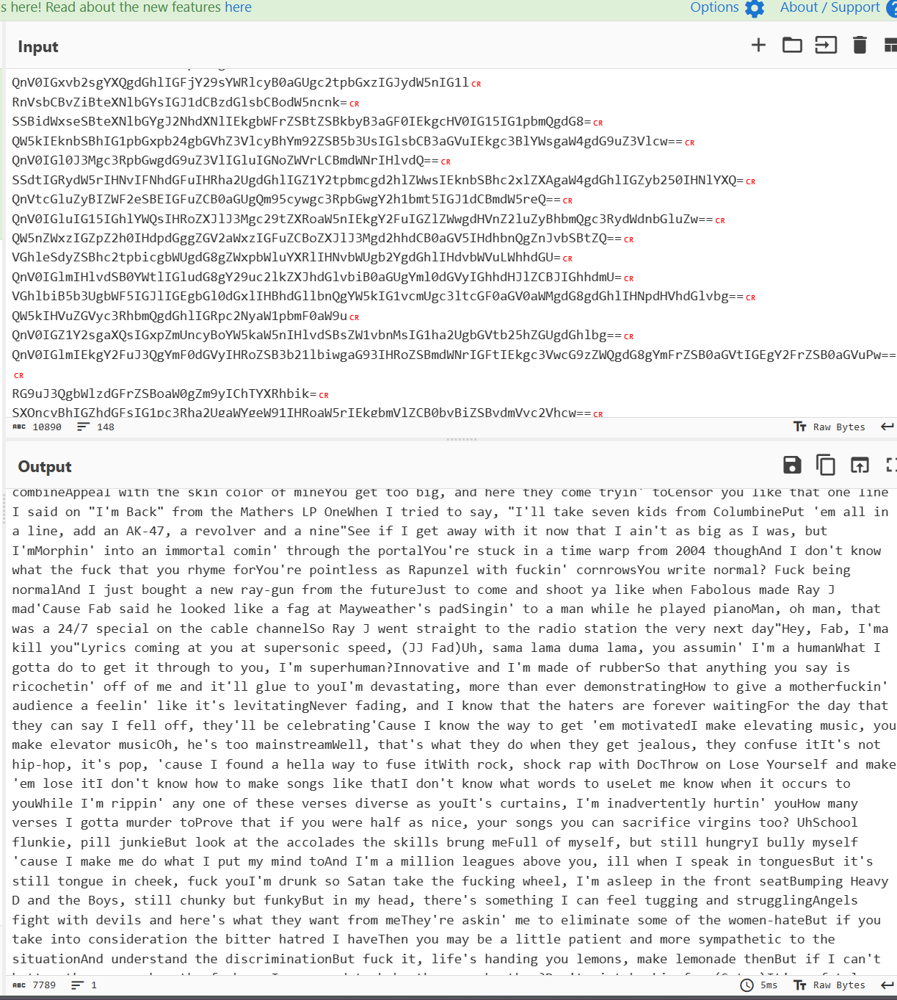

Mình nhìn kỹ đề bài là ``Hidden in the base``, mình tra gg thì có tìm được quả [link](https://excellium-services.com/2022/04/27/base64-padding-steganography/) rất chi là uy tín

Sau khi đọc thì mình phát hiện ra là base64 có thể giấu được tin. Vì ví dụ như là chữ ``A`` qua binary sẽ là ``01000001``, thế nhưng b64 chỉ lấy 6 bit và đổi theo bảng này

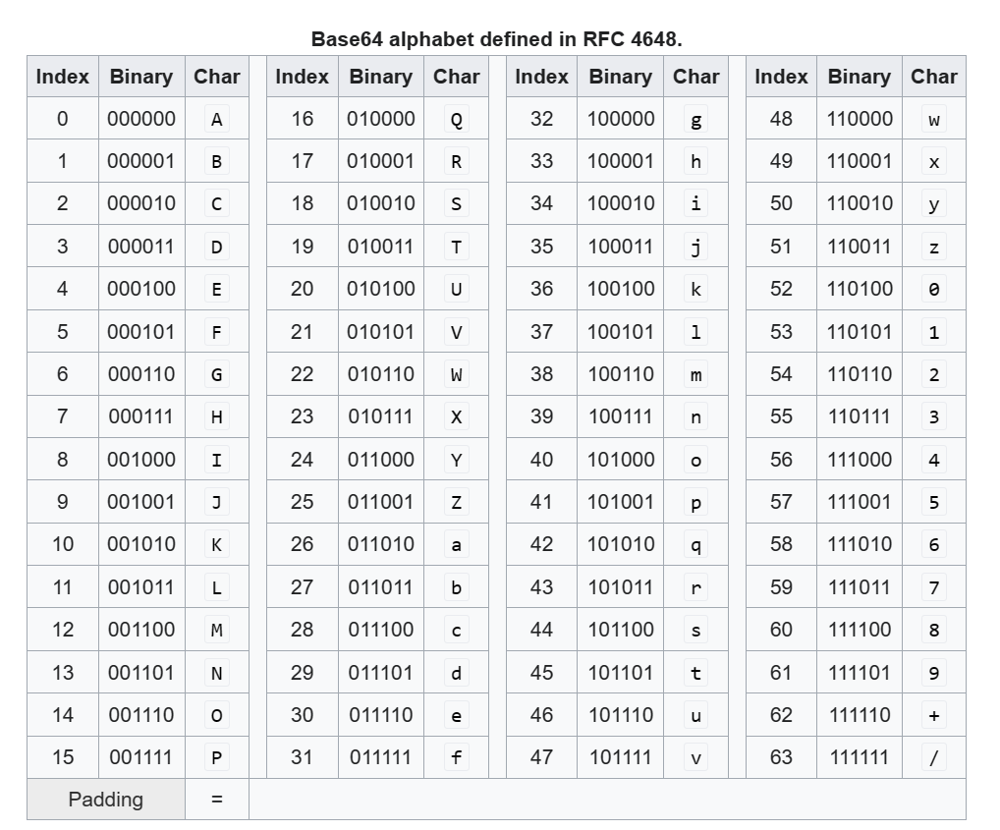

Thế nên sẽ bị thừa mất 2 bit, pad thêm 4 bit là ``010000010000`` đó là lúc cần dấu ``=``, thì ``A = QQ==``, thế nhưng chỉ có 6 bit đầu là liên quan tới ký tự A, và mình có thể đổi 4 bit sau thành gì cũng được.

Ví dụ là ``QV==`` thì vẫn là ký tự ``A`` nhưng mà sai phương pháp padding của base64. Đây chính là cách giấu tin của base64.

Nếu là ``==`` pad 4 bit thì sẽ lấy 4 bit cuối, còn nếu ``=`` thì sẽ lấy 2 bit cuối.

Code giải stego của mình như sau
```
from base64 import*
from string import*
dic = {
    "A": "000000",
    "B": "000001",
    "C": "000010",
    "D": "000011",
    "E": "000100",
    "F": "000101",
    "G": "000110",
    "H": "000111",
    "I": "001000",
    "J": "001001",
    "K": "001010",
    "L": "001011",
    "M": "001100",
    "N": "001101",
    "O": "001110",
    "P": "001111",
    "Q": "010000",
    "R": "010001",
    "S": "010010",
    "T": "010011",
    "U": "010100",
    "V": "010101",
    "W": "010110",
    "X": "010111",
    "Y": "011000",
    "Z": "011001",
    "a": "011010",
    "b": "011011",
    "c": "011100",
    "d": "011101",
    "e": "011110",
    "f": "011111",
    "g": "100000",
    "h": "100001",
    "i": "100010",
    "j": "100011",
    "k": "100100",
    "l": "100101",
    "m": "100110",
    "n": "100111",
    "o": "101000",
    "p": "101001",
    "q": "101010",
    "r": "101011",
    "s": "101100",
    "t": "101101",
    "u": "101110",
    "v": "101111",
    "w": "110000",
    "x": "110001",
    "y": "110010",
    "z": "110011",
    "0": "110100",
    "1": "110101",
    "2": "110110",
    "3": "110111",
    "4": "111000",
    "5": "111001",
    "6": "111010",
    "7": "111011",
    "8": "111100",
    "9": "111101",
    "+": "111110",
    "/": "111111",
}
bina = ""
with open("rap","r") as file:
    datas = file.read()
    datas = datas.split("\n")
    
    for data in datas:
        new = ""
        for i in data:
            if i in printable[:-6]:
                new += i
        if "==" in new:
            bina += dic[new[-3:-2]][2:]
        else:
            if "=" in new:
                bina += dic[new[-2:-1]][4:]
print(bina)

```

Output sẽ là 1 đoạn binary như sau
```
0100011001110110011101110110001000101010001001000100100101100101001000100100011101011110010100110000000000000000000000000000000000000000000000000000000000000000000000000000000000000000000000000000000000000000000000000000000000000000000000000000000000000000000000000000000000000000000000000000000000000000
```

Decode thì thu được password

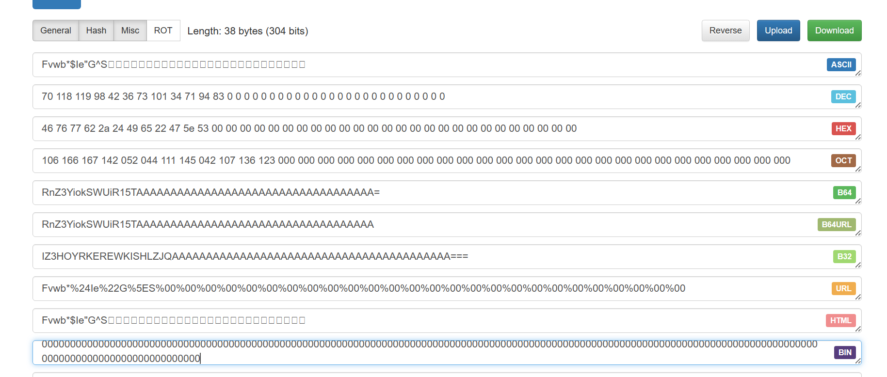

Pass sẽ là ``Fvwb*$Ie"G^S``

Giờ thì mình unzip file 7z kia thui nàooo

Mình thu được 1 cái ảnh như này


Nhìn ở tên thì thu được flag 
**Flag: KCSC{L0$T_Ev3ry7h1n9}**