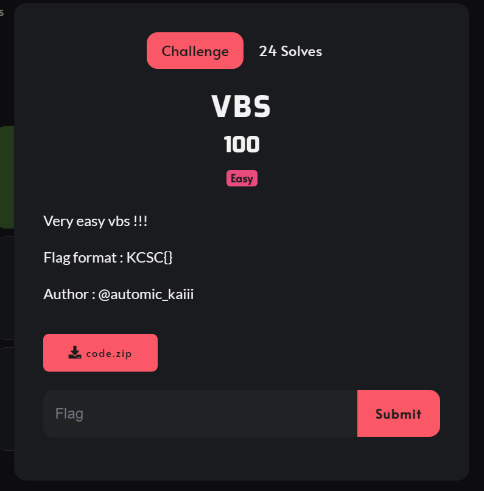
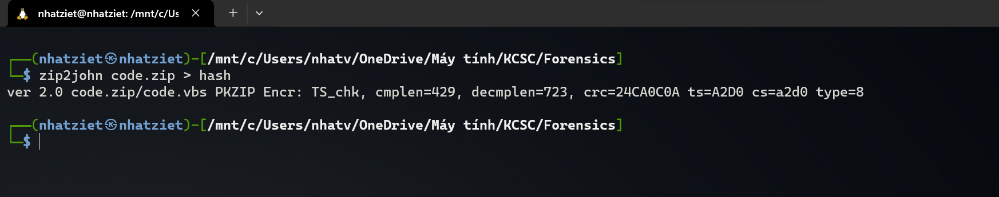
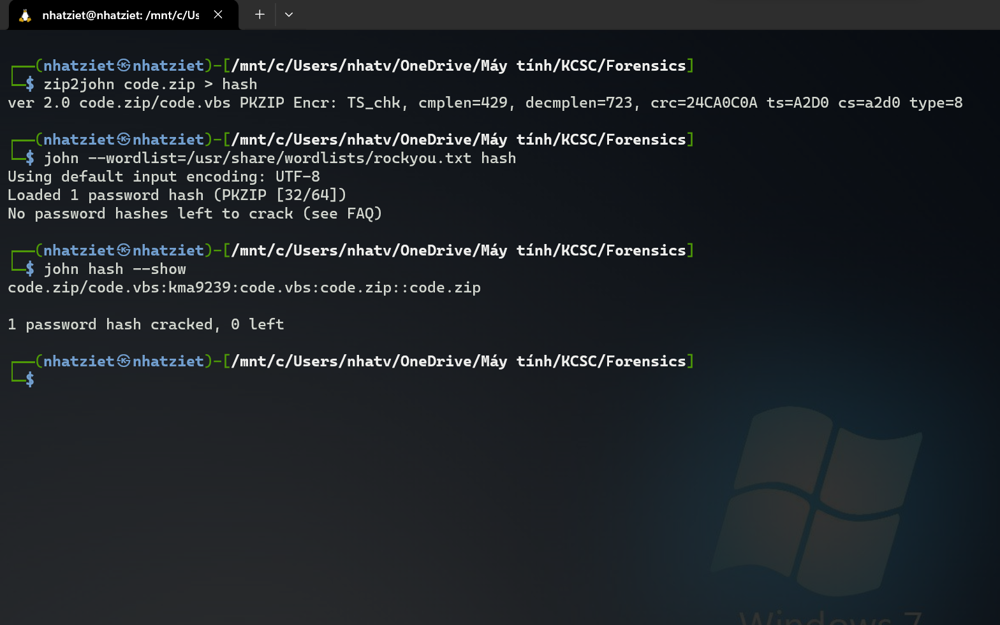
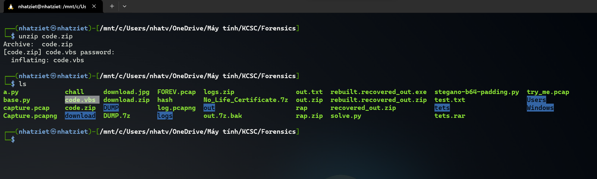
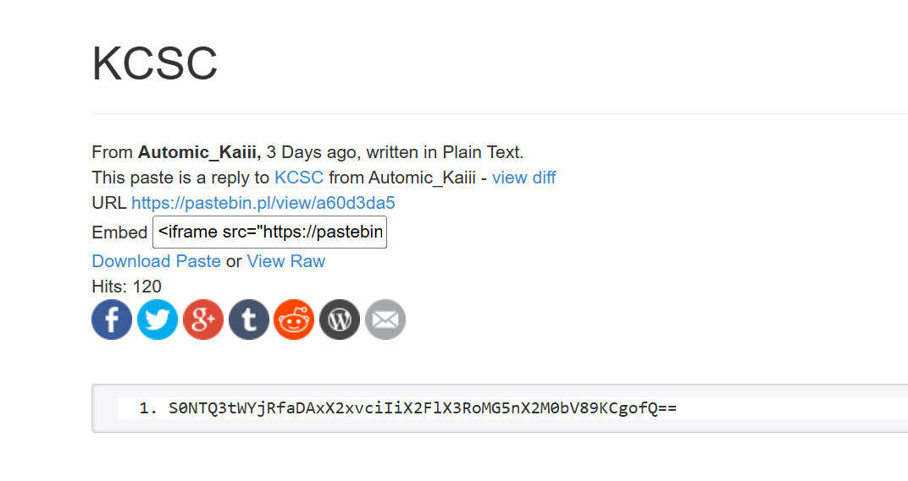
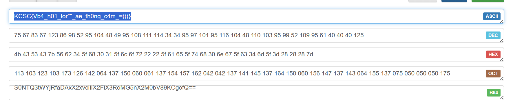

# VBS



Chall có đưa cho ta 1 file ``code.zip``, thế nhưng lại bị mật khẩu.


Giờ mình sẽ dùng ``johntheripper`` để crack password nha.

Trước hết mình phải ``zip2john`` file ``code.zip`` này trước đã.

```
zip2john code.zip > hash
```



Giờ mình bắt đầu crack nha.
```
john --wordlist=/usr/share/wordlists/rockyou.txt hash
```



Ta có thể thấy password của file zip này là ``kma9239``.

Giờ thì unzip nó ra thôi.



Ta thu được code như sau

```
Dim http : Set http = CreateObject("MSXML2.ServerXMLHTTP.6.0")
Dim url : url = "http://api.bitly.com/v3/shorten?login=YOUR_BITLY_USERNAME&apiKey=YOUR_BITLY_API_KEY&longUrl=https://pastebin.pl/view/a60d3da5"

http.Open "GET", url, False
http.setRequestHeader "Content-Type", "text/xml"
http.send ""

If http.Status = 200 Then
    Dim response : response = http.responseText
    Dim shortUrl : shortUrl = ParseJson(response)("data")("url")
    WScript.Echo "Shortened URL: " & shortUrl
Else
    WScript.Echo "Error: " & http.Status & " - " & http.statusText
End If

Function ParseJson(json)
    Dim objJson : Set objJson = CreateObject("MSJSON.Parser")
    Set ParseJson = objJson.Parse(json)
End Function
```

Nhìn vào code này thì mình thấy có 1 link pastebin là ``https://pastebin.pl/view/a60d3da5``, vào thì được như sau




Là base64 ``S0NTQ3tWYjRfaDAxX2xvciIiX2FlX3RoMG5nX2M0bV89KCgofQ==``, giờ thì decode ra thôi.




```
Flag: KCSC{Vb4_h01_lor""_ae_th0ng_c4m_=(((}
```