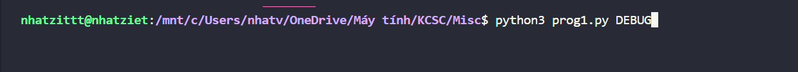

# Prog 1: Max

Chall yêu cầu tìm max của 1 mảng như sau


Bài này không có gì cả nên là mình viết code lun thôi

```
from pwn import*

io = remote("103.162.14.116",14002)
io.recvuntil(b"Prog1: Find the Maximum Value in an Array.\n")
while True:
    io.recvuntil(b"arr = [")
    data = (io.recvuntil(b']\n',drop=True).decode())
    lst = data.split(', ')
    max = -20000000000
    for i in lst:
        if int(i) > max:
            max = int(i)
    io.recvuntil(b'max = ')
    io.sendline(str(max).encode())
io.interactive()
```




**Flag: KCSC{Ezzz_Programmingggg}**