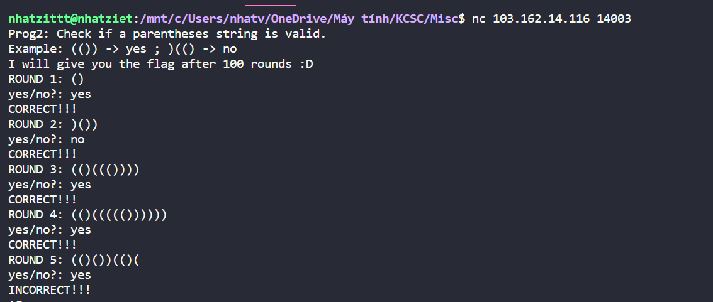
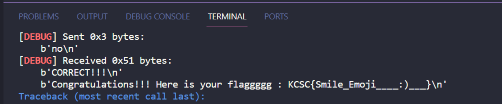

# Prog2: True Parenthses

Chall yêu cầu ta nhập yes no sao cho đúng với từng dãy ngoặc đơn. Nếu đóng ngoặc đầy đủ thì yes, còn ngược lại thì là no. Ta có thể nhìn ở ví dụ dưới đây



Bài này thì mình nhờ ChatGPT thì nó đưa mình 1 hàm check như sau

```
def is_valid_parentheses(string):
    stack = []
    for char in string:
        if char == '(':
            stack.append(char)
        elif char == ')':
            if len(stack) == 0 or stack.pop() != '(':
                return "no"
    return "yes" if len(stack) == 0 else "no"
```

Sau khi thử vài lần thì thấy nó đúng, mình sẽ code solution thôi

```
from pwn import*
def is_valid_parentheses(string):
    stack = []
    for char in string:
        if char == '(':
            stack.append(char)
        elif char == ')':
            if len(stack) == 0 or stack.pop() != '(':
                return "no"
    return "yes" if len(stack) == 0 else "no"

io = remote("103.162.14.116",14003)
for i in range(1,102):
    io.recvuntil(b'ROUND ' + str(i).encode() + b": ")
    data = io.recvuntil(b"\n")
    print(data)
    io.sendline(is_valid_parentheses(data.decode()).encode())
    io.recvuntil(b"CORRECT!!!\n")
io.intertractive()
```



Lụm flag

**Flag: KCSC{Smile_Emoji____:)___}**