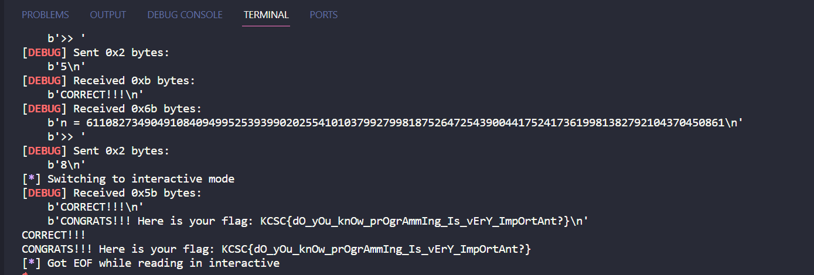

# Prog3: nth Num

Đọc yêu cầu thì ban đầu mình tính làm 1 file out.txt để lưu hết các ký tự từ 1 đến 1000000000 nhưng mà lâu quá nên mình thử làm cách khác.

Solution của mình đây

```
from pwn import*
def find_nth_digit(n):
    if n <= 0:
        return -1

    length = 1
    count = 9
    start = 1

    while n > length * count:
        n -= length * count
        length += 1
        count *= 10
        start *= 10
    num = start + (n - 1) // length
    digit_pos = (n - 1) % length
    digit = int(str(num)[digit_pos])

    return digit

io = remote("103.162.14.116",14004)
io.recvuntil(b'Output: 3\n')
for i in range(100):
    io.recvuntil(b"n = ")
    N = int(io.recvuntil(b'\n',drop=True).decode())
    io.recvuntil(b'>> ')
    io.sendline(str(find_nth_digit(N)).encode())
io.interactive()
```



**Flag: KCSC{dO_yOu_knOw_prOgrAmmIng_Is_vErY_ImpOrtAnt?}**