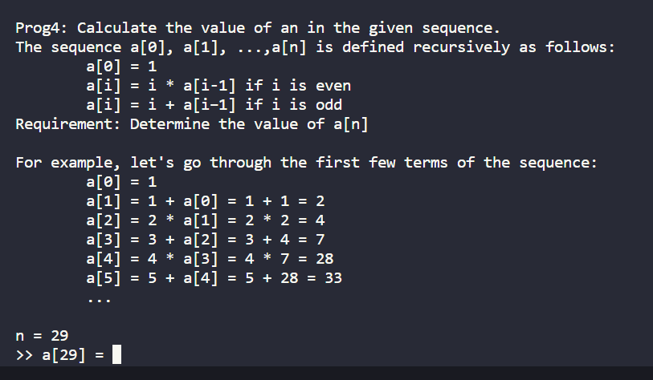
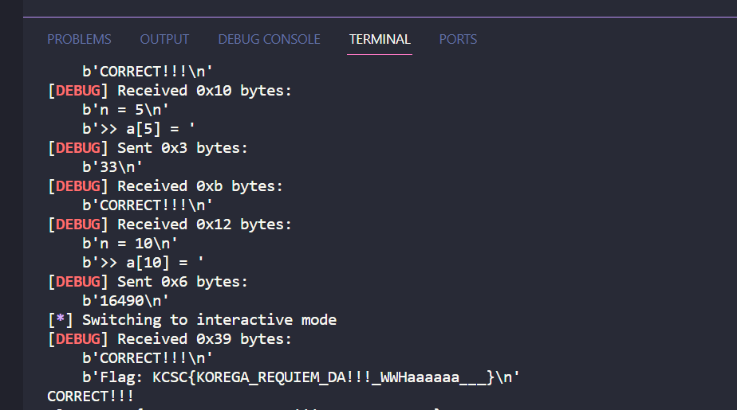

# Prog4: Requiem



Bài này ban đầu mình tính dùng đệ quy nhưng mà sau thì số to quá nên mình chuyển sang quy hoạch động đơn giản.

Đọc code mình phát là hỉu lun nè

```
from pwn import*

io = remote("103.162.14.116",14005)

io.recvuntil(b"...\n")
io.recvuntil(b"\n")
for i in range(100):
    io.recvuntil(b"n = ")
    N = int(io.recvuntil(b'\n',drop=True).decode())
    lst = [1]
    for i in range(1,N+1):
        if i % 2 ==0:
            lst.append(i*lst[i-1])
        else:
            lst.append(i+lst[i-1])
    io.recvuntil(b'] = ')
    io.sendline(str(lst[len(lst)-1]).encode())
io.interactive()
```




```
Flag: KCSC{KOREGA_REQUIEM_DA!!!_WWHaaaaaa___}
```