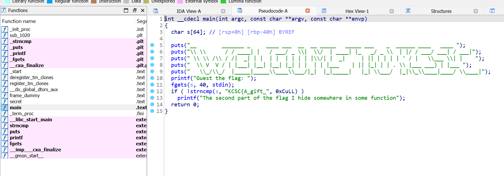
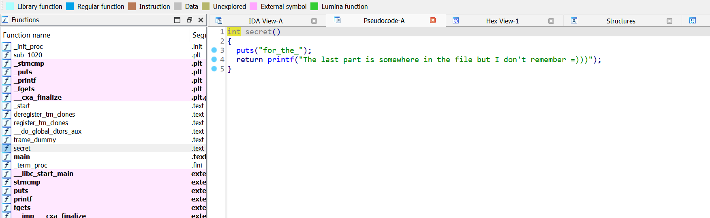
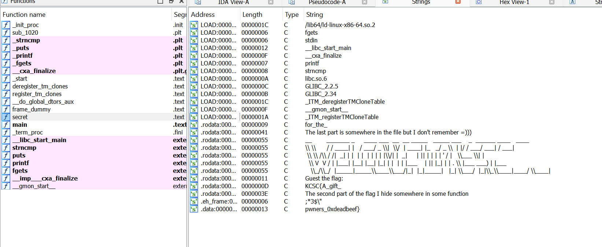

# A gift for pwners

Chall cho ta 1 file tên là ``gift``, ta dùng ida để mở coi có gì

Vào hàm main thì ta thấy được part1 của flag là ``KCSC{A_gift_``

Vào hàm secret thì thu được part2 của flag là ``for_the_``

Và cuối cùng vào strings của file thì thu được part cuối cùng là ``pwners_0xdeadbeef}``

**Flag: KCSC{A_gift_for_the_pwners_0xdeadbeef}**