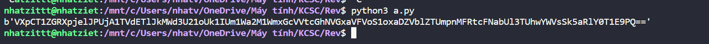

# Awg Mah Back

Chall cho ta 1 file ``src.py`` và 1 file ``output.txt``

```
from pwn import *

with open('flag.txt', 'rb') as (f):
    flag = f.read()
a = flag[0:len(flag) // 3]
b = flag[len(flag) // 3:2 * len(flag) // 3]
c = flag[2 * len(flag) // 3:]
a = xor(a, int(str(len(flag))[0]) + int(str(len(flag))[1]))
b = xor(a, b)
c = xor(b, c)
a = xor(c, a)
b = xor(a, b)
c = xor(b, c)
c = xor(c, int(str(len(flag))[0]) * int(str(len(flag))[1]))
enc = a + b + c
with open('output.txt', 'wb') as (f):
    f.write(enc)

```

Giờ mình chỉ cần xor ngược lại như bài là sẽ ra flag thui, không quan tâm gì hết

```
from pwn import*

l = 120
with open('output.txt', 'rb') as (f):
    flag = f.read()

a = flag[0:len(flag) // 3]
b = flag[len(flag) // 3:2 * len(flag) // 3]
c = flag[2 * len(flag) // 3:]

c = xor(c,2)
c = xor(c,b)
b =xor(a,b)
a = xor(c,a)
c = xor(b,c)
b = xor(a,b)
a = xor(a,3)
flag = a + b + c
print(flag)
```



THu được 1 mã b64, ta decode 3 lần là được

**Flag: KCSC{84cK_t0_BaCK_To_B4ck_X0r`_4nD_864_oM3g4LuL}**

