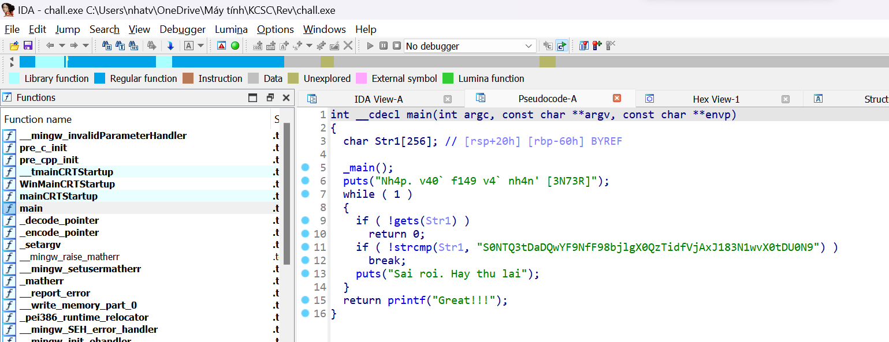
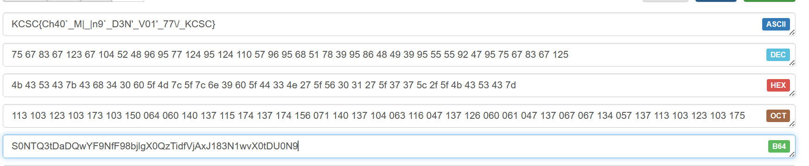

# Real Warmup

Chall có cho ta 1 file ``chall.exe``, mình mở ida lên, vào hàm main thì thấy quả mã quen quen ``S0NTQ3tDaDQwYF9NfF98bjlgX0QzTidfVjAxJ183N1wvX0tDU0N9``



Mình thử decode b64 thì ra lun flag =)))



```
Flag: KCSC{Ch40`_M|_|n9`_D3N'_V01'_77\/_KCSC}
```