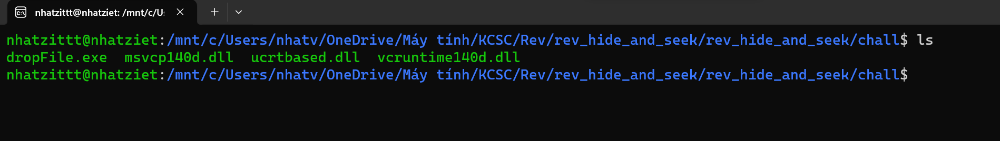
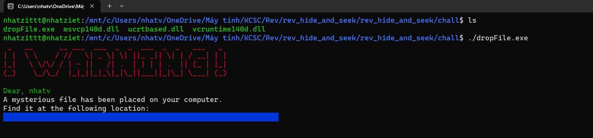
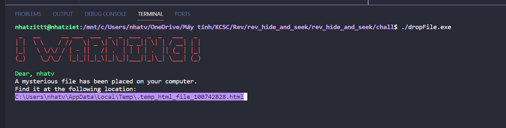
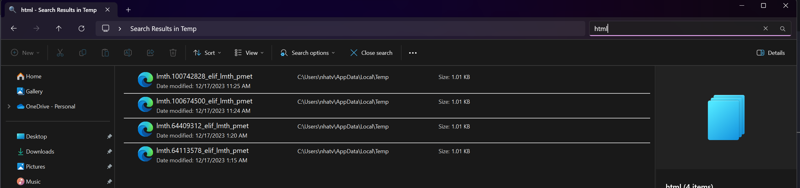
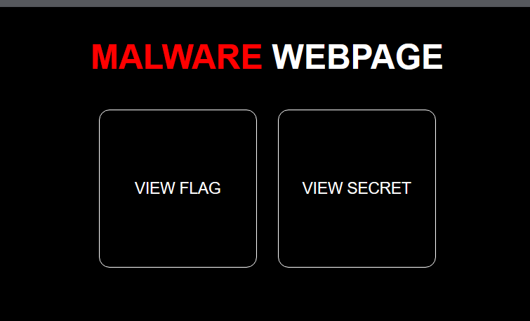
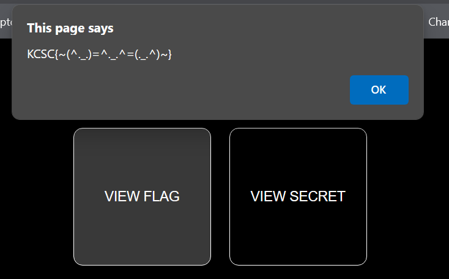

# hide and seek

Chall cho ta 1 folder có các file như sau



Author không ngờ gặp phải thằng liều, mình chạy luôn trên máy thật file ``dropFile.exe`` luôn thì được như này



Mình không thấy location là gì, nhưng mình dùng vscode mở lại thì lại thấy



Giờ mình sẽ vào folder Temp rồi tìm file có đuôi là html nha



Mình tìm thấy mấy file lạ lạ


Ấn vào lun thì ra cái web như này



Mình ấn vào View Flag thì có flag



```
Flag: KCSC{~(^._.)=^._.^=(._.^)~}
```