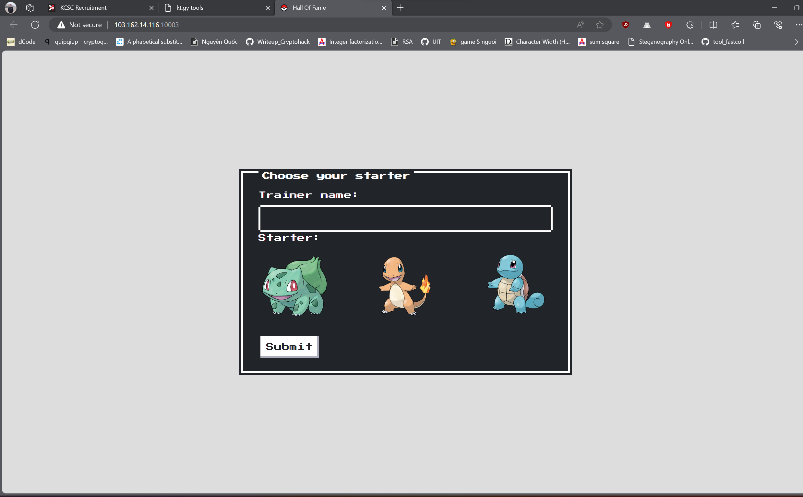
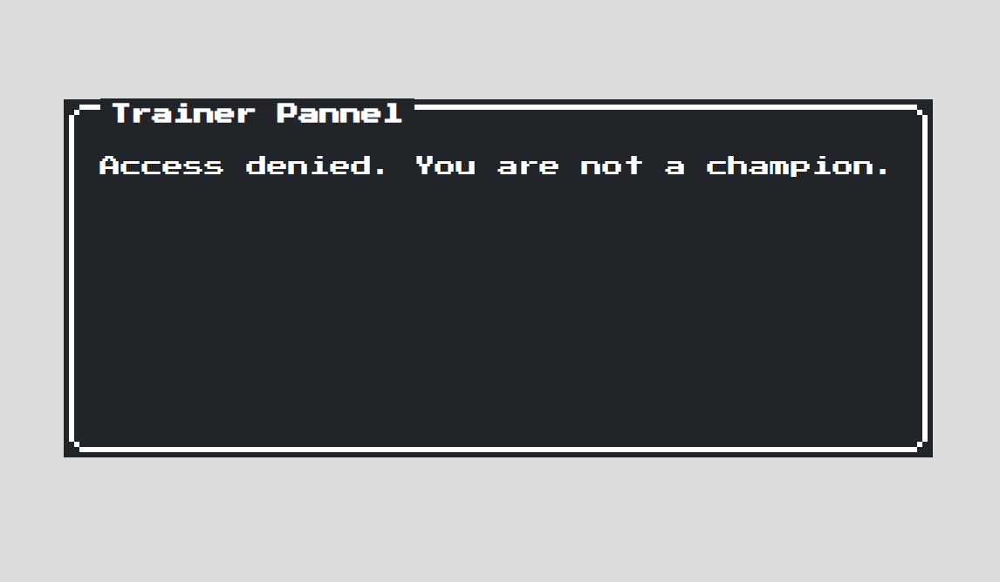
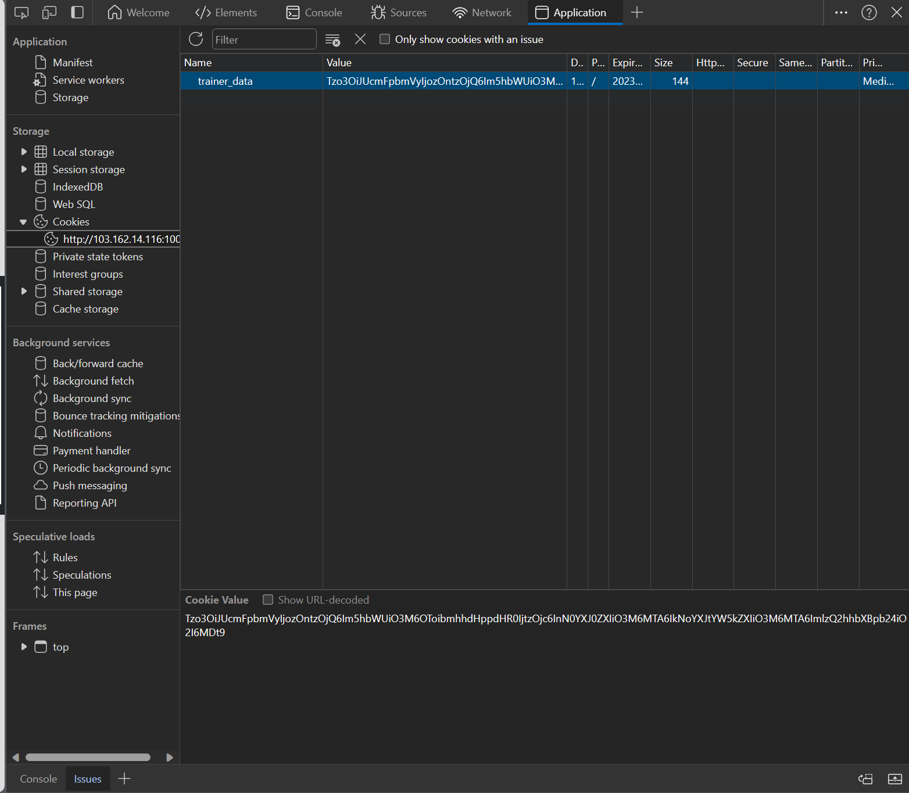
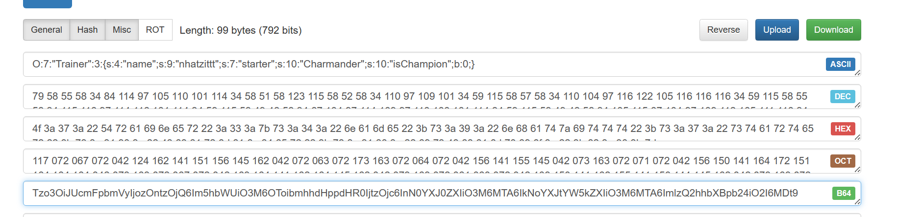
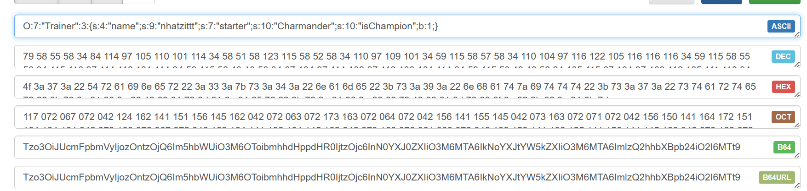
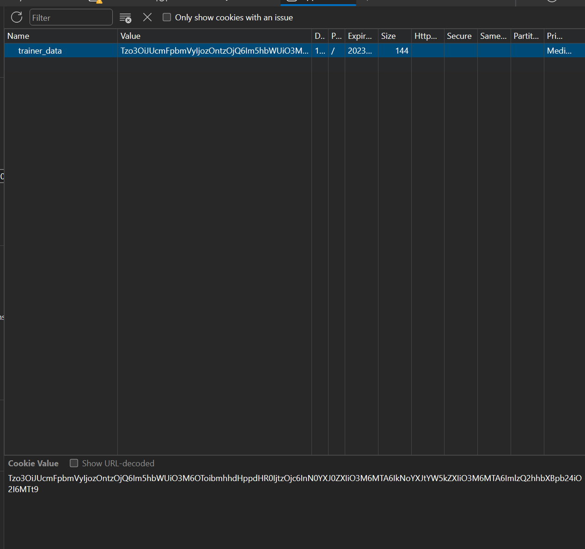
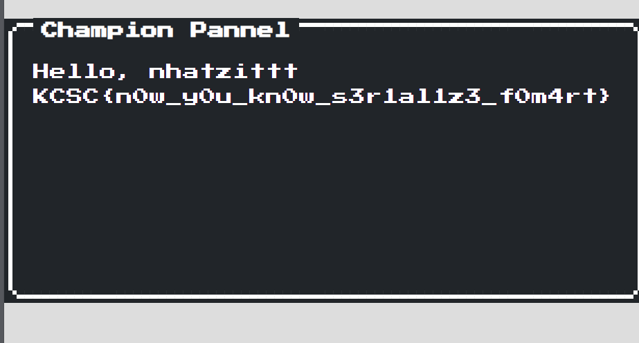

# Pokemon Hof Panel Level 1

Vào đường link thì ta được như sau



Giờ thì mình nhập tên và chọn con pokemon thôi



Bị từ chối rồi, mình vào check cookies thì được 1 mã b64



Decode thì thu được 1 đoạn payload như này



Mình đọc source thì có 1 đoạn như này
```
<?php
include("./classes/trainer.php");
include("./classes/utils.php");
function isChampion($user) {
    return $user->getChampion();
}

if (isset($_COOKIE["trainer_data"])) {
    $base64Encoded = $_COOKIE["trainer_data"];
    $serializedUser = base64_decode($base64Encoded);
    $user = unserialize($serializedUser);
    if (isChampion($user)) {
        $title = "Champion Pannel";
        $msg = "Hello, " . $user->getname() . " KCSC{level1_fakeflag}";
    } else {
        $title = "Trainer Pannel";
        $msg = "Access denied. You are not a champion.";
    }
} else {
    $title = "Something's wrong!!!";
    $msg = "No trainer data found. Please choose your starter.";
}
?>
```

Có nghĩa là nếu ``isChampion(user)`` là ``True`` thì mình sẽ thu được flag, còn nếu ``False`` thì sẽ bị từ chối như hình trên.

Nhìn đoạn payload trên thì thấy ``isChampion`` của mình đang là 0, mình sẽ sửa thành 1.



Rồi mình lấy cái base64 đó thay giá trị cookies thôi



Refresh lại trang thì thu được flag




**Flag: KCSC{n0w_y0u_kn0w_s3r1al1z3_f0m4rt}**

